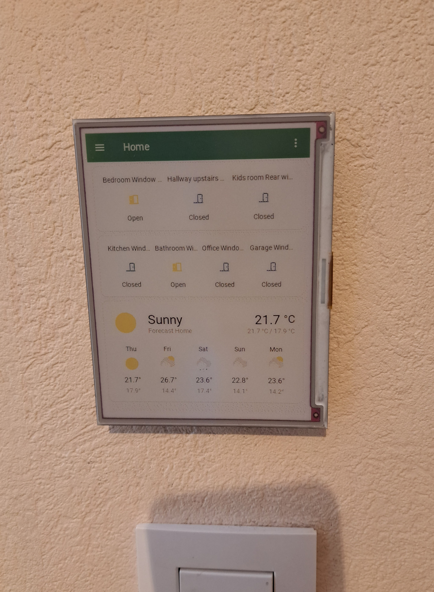

About a year ago we moved to a new house. The light-to-switch situation downstairs was unbelievably inconsistent. To fix that, I placed little Zigbee switches behind every light toggle, and taped Philips Hue Dimmer switches over the old physical ones. Thus began my journey into smart homes.

A year later, the biggest first world problem I had was losing time running around the house, closing all windows, before rushing out to pick up the kids from school. There's not a lot of crime around here, but if they get you, it's by learning your patterns of forgetfulness.

The _obvious_ answer was to install Zigbee sensors on all the windows, and put a small screen next the front door.

Turns out Raspberry Pi powered color e-ink displays are actually not that expensive, so that's what I went with:

However the software side of things was rubbish.

Enter FrameOS.

It started out as a bunch of scripts to copy software onto the Pi, and scope-creeped its way into a visual programming environment of sorts.

