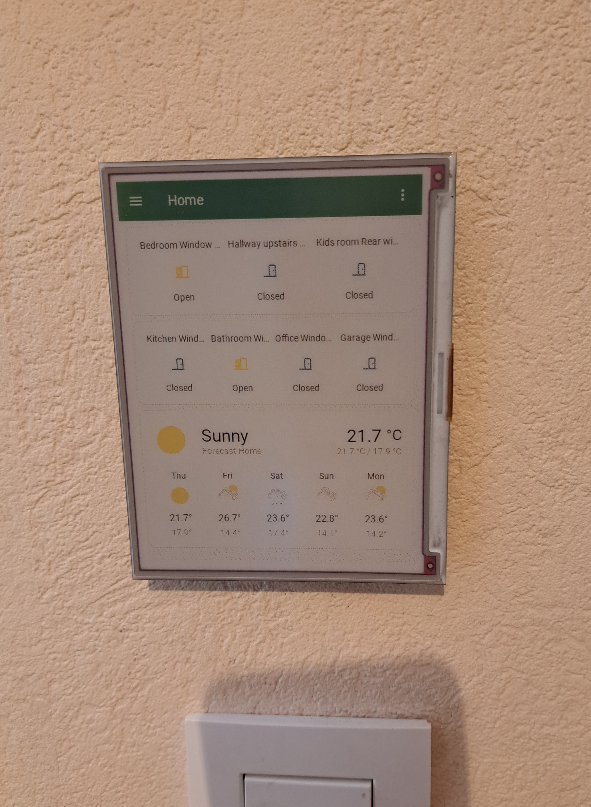
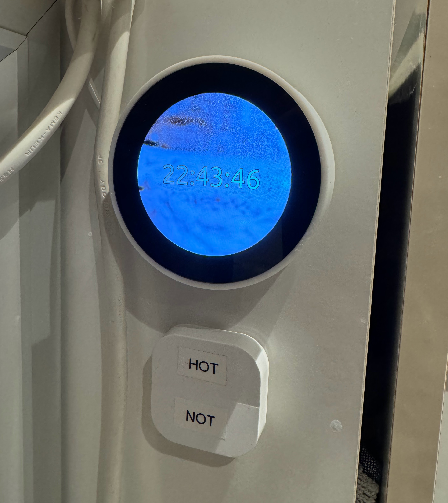

FrameOS [started its life](/blog/why-frameos) as a Python app that displays an image on a
[Pimoroni eInk display](https://shop.pimoroni.com/products/inky-impression-5-7?variant=32298701324371) that's connected to a
[Raspberry Pi Zero W](https://amzn.to/3TLIKB7):

... and a web interface to edit and deploy apps over SSH to said Raspberry Pi:

I wrote it in Python, as that's what the e-ink display drivers came in. It took 40 seconds to refresh the display, so
speed of rendering was not a concern.

In the meanwhile, I had added another screen to my house, a cute little [Pimoroni
HyperPixel 2.1 Round](https://shop.pimoroni.com/products/hyperpixel-round?variant=39381081882707) to control the hot water in the bathroom:

I was able to get FrameOS running on it at *2 FPS*. While that's enough to show a clock with just seconds, it won't be enough
if I want to add a temperature slider or any other interactive elements.

While an eventual rewrite of FrameOS in a compiled language seemed inevitable (why not get the speed and efficiency gains?),
seeing how this Python MVP was already getting usage in the wild, I decided to jump the gun and rewrite it all in [Nim](https://nim-lang.org/)
already now. Doing it later would have been painful for everyone.

### But why nim?

What sold me on it were 1) it's features, 2) the praise in the [Nim 2.0 HN post](https://news.ycombinator.com/item?id=36955806),
3) the fact that it definitely [is used for real time graphics](https://github.com/jmgomez/NimForUE), and 4) the fact that it has
a great graphics library called [pixie](https://github.com/treeform/pixie/) that supports both SVG and font rendering out of the box.

It's syntax is really friendly after [just a bit of usage](https://learnxinyminutes.com/docs/nim/), it compiles really fast,
it has great interop with C libraries, and did I mention it has a great graphics library?

> If you imagine native-compiled type-annotated Python where nearly 100% of your code is business logic with no cruft, you're getting close to the Nim experience.

The closest thing to a useful SVG and font library in Python would have been [pixie-python](https://github.com/treeform/pixie-python),
but it's one version behind the nim version, and at this point, why bother with the extra layer of abstraction?

The other compiled languages I considered, like Rust, Zig, Mojo, and Go, all had their own issues. Going deep into them would
be a post of its own, so let's leave it there.

### The rewrite

The rewrite was pretty straightforward. It of course took longer than expected, but after about a week of work, I now have something
that is ([almost](https://github.com/FrameOS/frameos/issues/1)) feature complete with the Python version that came before it,
while being 10x as fast. :fire::fire::fire:

I also sneaked in a few new features: inline code snippets to override any value, and color fields.

Sadly the rewrite is not fully backwards compatible, as I took the opportunity to clean up some variable and other names.
I ask for forgiveness, and hope the 10x wins in efficiency make it well worth it though. It's best to restart all scenes from scratch.

If you wish to remain on the old python version, make sure to stop using the `latest` docker tag, and
instead pin [to the last docker tag](https://hub.docker.com/r/frameos/frameos/tags?page=1&ordering=last_updated&name=legacy-python-)
that starts with `legacy-python-`.

I hope you enjoy the new version, and I'm looking forward to seeing all the cool FrameOS apps in the wild. :heart:

The work is not done yet. The [todo list](https://github.com/FrameOS/frameos/issues/1) keeps expanding.