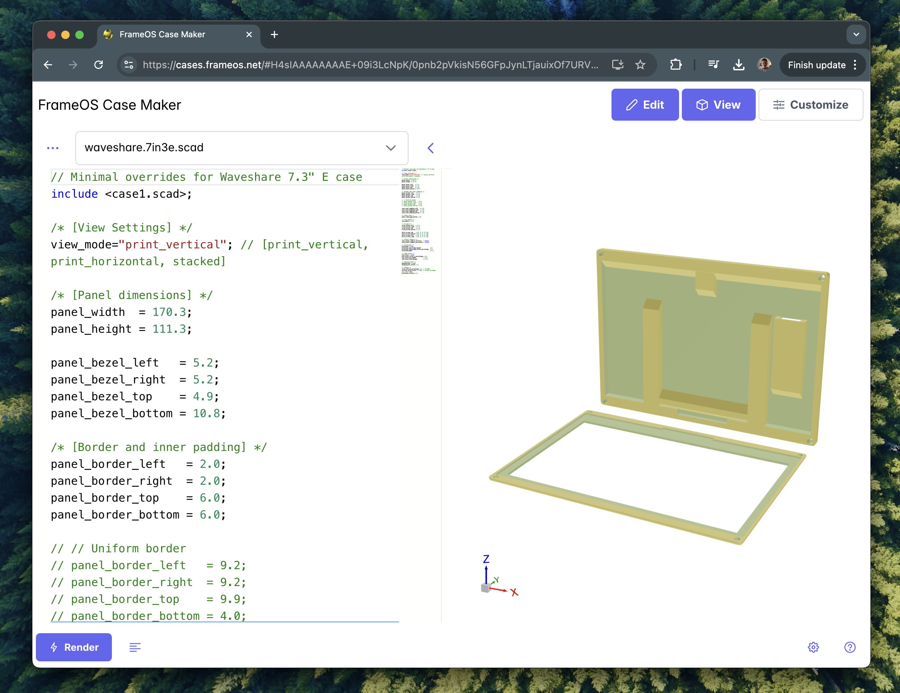
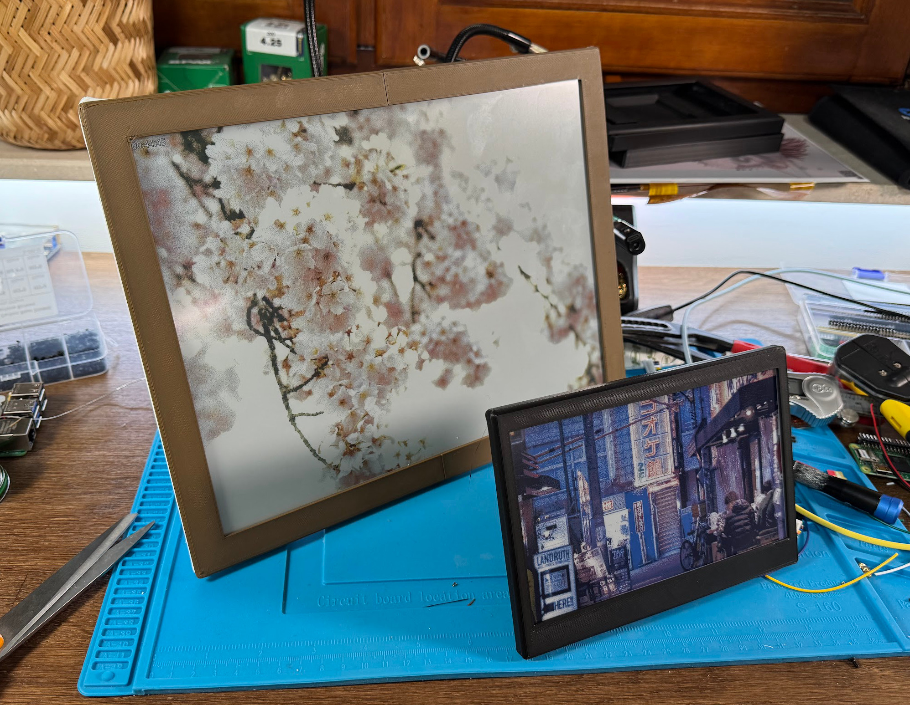
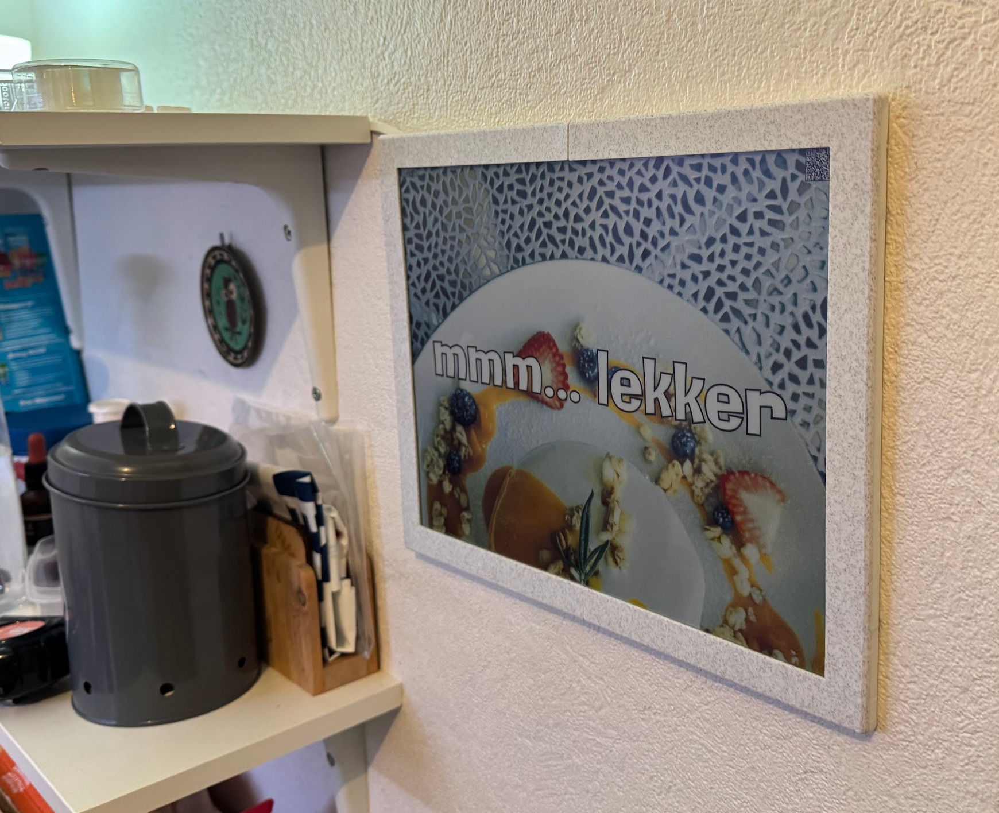
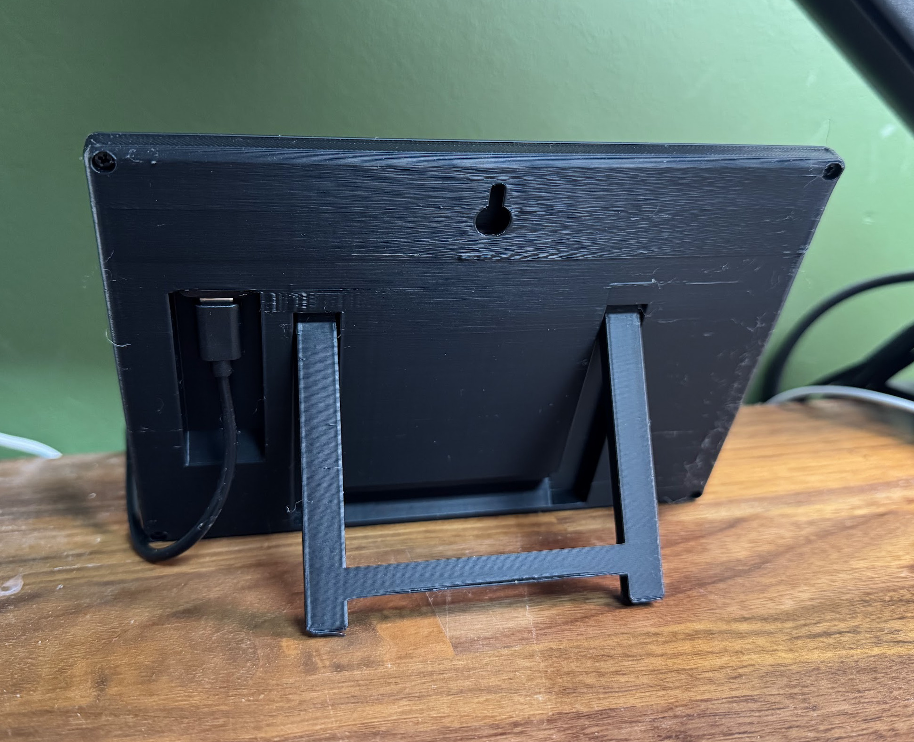

Introducing [The FrameOS Case Maker](https://cases.frameos.net)!

When my new [6-color Spectra](https://github.com/FrameOS/frameos/pull/118) [e-ink panels](https://github.com/FrameOS/frameos/pull/119) arrived, I had to make a case for them.
Having just spent way too long on a [case for the 12.48" panel](https://www.youtube.com/watch?v=hpfgWoF0-38), the propsect of doing it all over again wasn't very appealing. So I decided to tackle this problem once and for all.

I learned of [Bambu Lab's Makerworld's Makerlab's Parametric Model Maker](https://makerworld.com/en/makerlab/parametricModelMaker), and of [OpenSCAD](https://openscad.org/) that powers it all. 
I also learned of the [OpenSCAD playground](https://ochafik.com/openscad2/), which seemed like a self-hosted version of Bambu's stuff.

A few days of modelling and coding later, and we now have this:

So go ahead, design and print a custom enclosure for your frame in the [FrameOS Case Marker](https://cases.frameos.net)!

If you end up adjusting the parameters for a frame we don't yet have listed, submit a PR with your changes here: https://github.com/FrameOS/cases