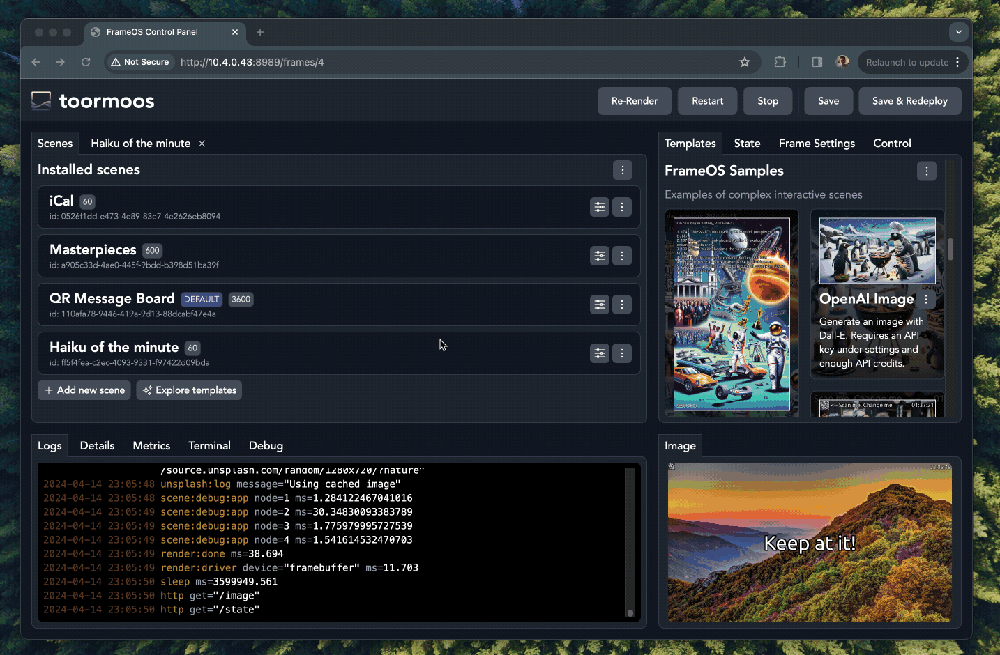
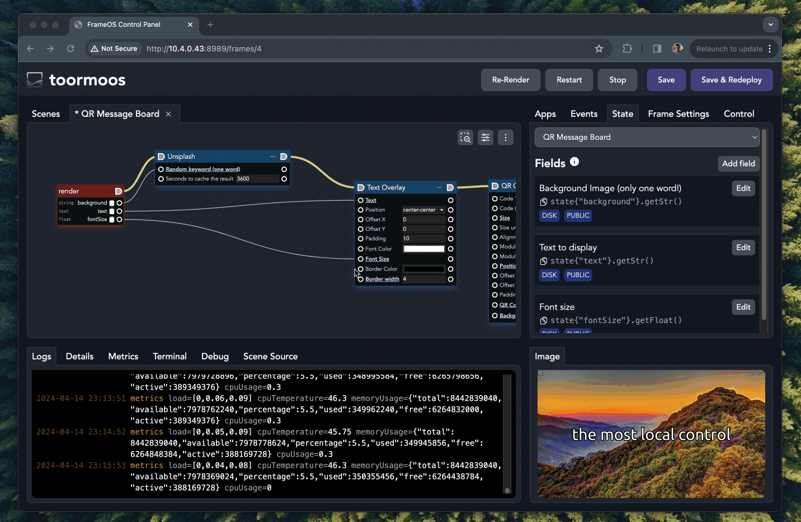

# FrameOS Apps Guide

## Adding apps to a frame

In FrameOS, each frame consists of multiple scenes. 


Once deployed, you can switch back and forth between scenes using the Control tab, or the frame's Control URL.



Each scene consists of apps. You drag them from the "apps" tab, and connect them in whatever order makes sense:


## Editing apps

Click the "edit" button next to an app to edit its source. You can edit all apps, including the built-in ones.

## Coding guidelines

- The best advice is to follow by example. Look at the [built in apps](https://github.com/FrameOS/frameos/tree/main/frameos/src/apps) and the provided scene templates for inspiration.
- Look at the source of [the types.nim file](https://github.com/FrameOS/frameos/blob/main/frameos/src/frameos/types.nim#L83) to see the general structure of the app.
- The `render` event is your starting point. It's called on a timer you can set under the scene's config, or when the `render` event is dispatched from any other app.
- The render `context` comes with an `image` that you can draw on.  
- The context also contains a `state` JSON node that is carried between apps, but gets cleared every render. Apps can use instance variables to persist state between renders.
- The files [`utils/image.nim`](https://github.com/FrameOS/frameos/blob/main/frameos/src/frameos/utils/image.nim) and  [`utils/font.nim`](https://github.com/FrameOS/frameos/blob/main/frameos/src/frameos/utils/font.nim) might also be of interest.
- Double check before you blindly install someone else's apps or scene templates. Apps can still do almost anything on a frame, so be careful. 

## Example app

Here's the example `Code` app from the "Boilerplate" category. The app sets a scene state variable, and draws a blue heart:

```python
import json, strformat
import pixie
from frameos/types import FrameScene, FrameConfig, ExecutionContext, Logger

type
  AppConfig* = object
    keyword*: string

  App* = ref object
    nodeId*: string
    scene*: FrameScene
    frameConfig*: FrameConfig
    appConfig*: AppConfig

proc init*(nodeId: string, scene: FrameScene, appConfig: AppConfig): App =
  result = App(
    nodeId: nodeId,
    scene: scene,
    frameConfig: scene.frameConfig,
    appConfig: appConfig,
  )

proc log*(self: App, message: string) =
  self.scene.logger.log(%*{"event": &"{self.nodeId}:log", "message": message})

proc error*(self: App, message: string) =
  self.scene.logger.log(%*{"event": &"{self.nodeId}:error", "error": message})

proc run*(self: App, context: ExecutionContext) =
  self.log(&"Hello from {context.event} {self.appConfig.keyword}")
  self.scene.state["count"] = %*(self.scene.state{"count"}.getInt(0) + 1)

  if context.event == "render":
    context.image.fillPath(
      """
        M 20 60
        A 40 40 90 0 1 100 60
        A 40 40 90 0 1 180 60
        Q 180 120 100 180
        Q 20 120 20 60
        z
      """,
      parseHtmlColor("#FC427B").rgba
    )
```

## State

Each scene can expose publicly controllable state:



State can be publicly controllable or private. It can be persisted to disk to survive power loss, or reset each time.

The `state` object is a standard nim's [JsonNode](https://nim-lang.org/docs/json.html). So access it accordingly. This means use code like `state{"field"}.getStr()` to access values, and `state{"field"} = %*("str")` to store them.
