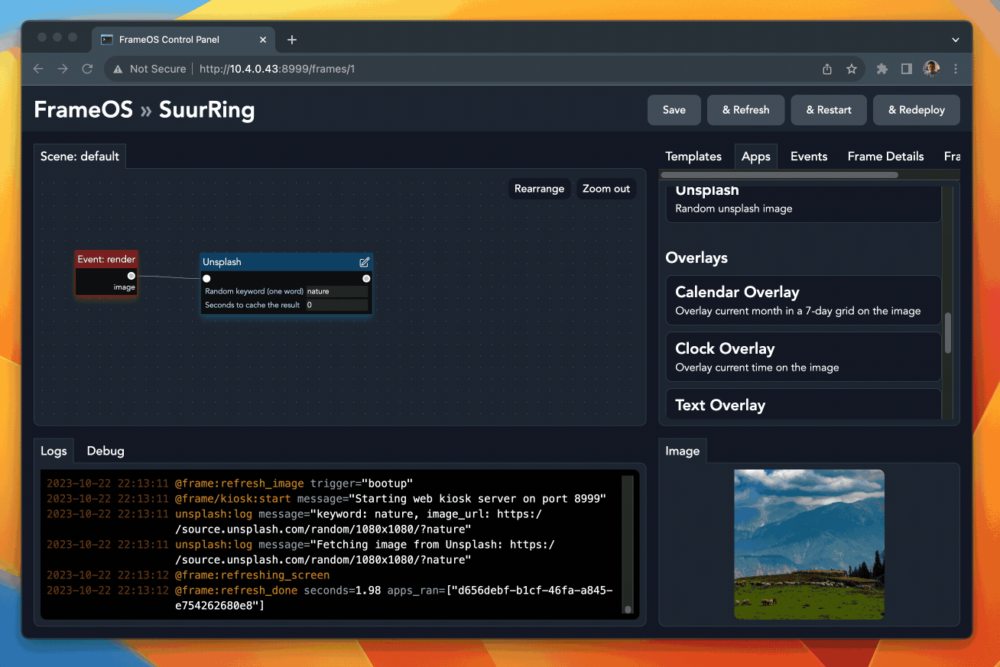
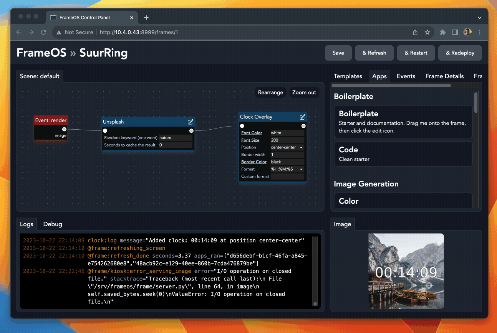
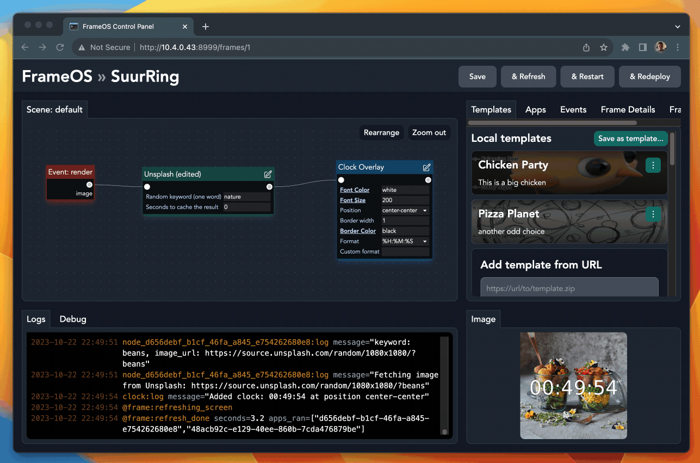

# FrameOS Apps Guide

## Adding apps to a frame

In FrameOS, each frame consists of one "Scene: default" (more coming soon), onto which you add apps. You drag them from the "apps" tab, and connect to whatever makes sense:



## Editing apps

Click the "edit" button next to an app to edit its source. You can edit all apps, including the built-in ones.

Suppose you want a random image from a list of keywords. Just edit the "unsplash" app, and change the relevant lines. Then save and redeploy:



Hot tip: doubleclicking on a tab maximizes it.

## Coding guidelines

- The best advice is to follow by example. Look at the [built in apps](https://github.com/mariusandra/frameos/tree/main/frameos/apps) for inspiration.
- Look at the source of [the App class](https://github.com/mariusandra/frameos/blob/main/frameos/apps/__init__.py#L83) itself to see what methods you have available.
- Apps can do anything. Some, like [screenshot](https://github.com/mariusandra/frameos/blob/main/frameos/apps/screenshot/frame.py), can be quite invasive by even installing packages via `apt` and `pip` on init.
- The `render` event is your starting point. It's called when `self.rerender()` is called after any other event. 
- The `render` event is also called on a timer you can set under the frame config.
- The file [`image_utils.py`](https://github.com/mariusandra/frameos/blob/main/frameos/frame/image_utils.py) might also be of interest.

## Example app

Here's the example `Code` app from the "Boilerplate" category:

```py
import io
import requests
from PIL import Image, ImageDraw, ImageFont
from apps import App, ExecutionContext
from frame.image_utils import draw_text_with_border

class CodeApp(App):
    def run(self, context: ExecutionContext):
        self.log(f"hello")

        if context.event == 'render':
            url = f"https://picsum.photos/{context.image.width}/{context.image.height}"
            context.image = Image.open(io.BytesIO(requests.get(url).content))

        if context.event == 'button_press':
            context.state['last_button'] = context.payload.get('label')
```

## Templates

Each scene can be saved as a template. Templates can be exported and imported. They can also be shared via repositories. The repository formats are still a work in progress, but check the [frameos-repo](https://github.com/mariusandra/frameos-repo) repository for an example. It's running the `bin/build.py` script before publishing to https://repo.frameos.net/.



You can add the default template repository by pasting in `https://repo.frameos.net/versions/0/templates.json` in the "Templates" tab.


## Built in apps

The following apps are installed by default. See their
[source code](https://github.com/mariusandra/frameos/tree/main/frameos/apps) on Github.

### Helpers

- Boilerplate - starter and documentation
- Code - clean starter

### Image Generation

- Set a single color
- Download an image from a URL
- Google Photos (simple HTML scraper, no OAuth key dance)
- Graident
- OpenAI DallE 2
- On device Chromium screenshots (64bit raspberries only)
- Random Unsplash photo

### Overlays

- Calendar
- Clock
- Text

### Utilities

- Resize
- Rotate
- Read home assistant sensor data
- Break event if rendering
