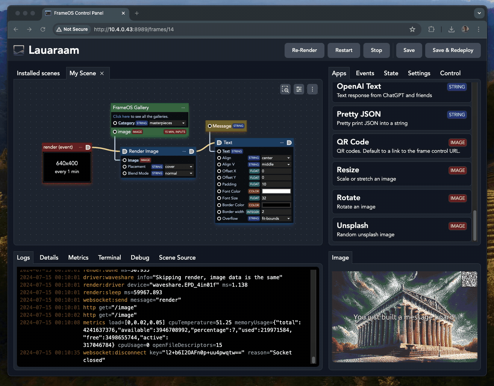

# Editing apps

### Edit any app

Click the "edit" button next to an app to edit its source. You can edit all apps, including the built-in ones. Any changes you save will be forked onto the scene. The original app will be unmodified.



### Coding guidelines

- The best advice is to follow by example. Look at the [built in apps](https://github.com/FrameOS/frameos/tree/main/frameos/src/apps) for inspiration.
- Look at the source of [the types.nim file](https://github.com/FrameOS/frameos/blob/main/frameos/src/frameos/types.nim#L83) to see the general structure of the app.
- Look at [apps.nim](https://github.com/FrameOS/frameos/blob/main/frameos/src/frameos/apps.nim) and the files in the [utils/](https://github.com/FrameOS/frameos/tree/main/frameos/src/frameos/utils) folder to see what other functions are available.

- The `render` event is your starting point. It's called on a set timer, or when the `render` event is dispatched from any other app.
- The render `context` comes with an `image` that you can draw on.  
- The context also contains the `state` JSON node that is carried between apps, but gets cleared every render. To persist between renders, use instance variables on the `App` object.
- Double check before you blindly install someone else's apps or scene templates. Apps can still do almost anything on a frame, so be careful. 

### Example app

Here's the source for the "Color" render app. This app can run in two modes, "get" (data app / green node) or "run" (render app / blue node).

```python
import pixie
import options
import frameos/apps
import frameos/types

type
  AppConfig* = object
    inputImage*: Option[Image]
    color*: Color

  App* = ref object of AppRoot
    appConfig*: AppConfig

proc render*(self: App, context: ExecutionContext, image: Image) =
  image.fill(self.appConfig.color)

proc run*(self: App, context: ExecutionContext) =
  render(self, context, context.image)

proc get*(self: App, context: ExecutionContext): Image =
  result = if self.appConfig.inputImage.isSome:
    self.appConfig.inputImage.get()
  elif context.hasImage:
    newImage(context.image.width, context.image.height)
  else:
    newImage(self.frameConfig.renderWidth(), self.frameConfig.renderHeight())
  render(self, context, result)

```

### State

The `state` object is a standard nim [JsonNode](https://nim-lang.org/docs/json.html). Access it accordingly. This means use code like `state{"field"}.getStr()` to access values, and `state{"field"} = %*("str")` to store them.

Even better, just drag the yellow state nodes onto your scene and wire them up directly.