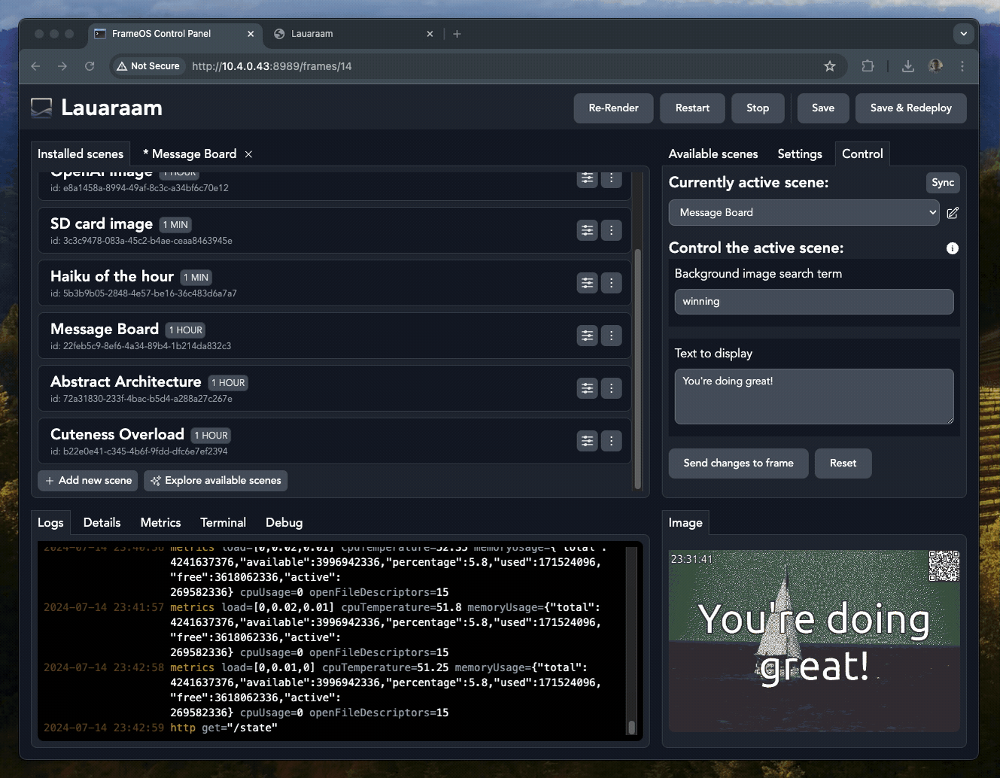
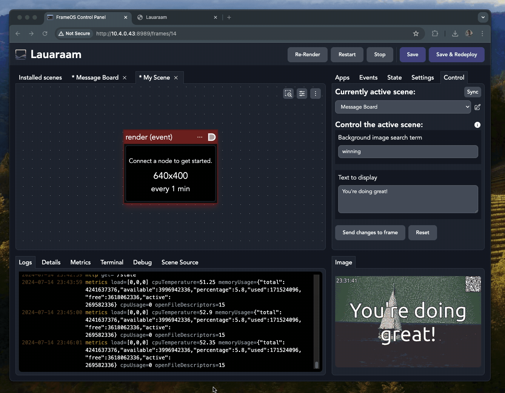
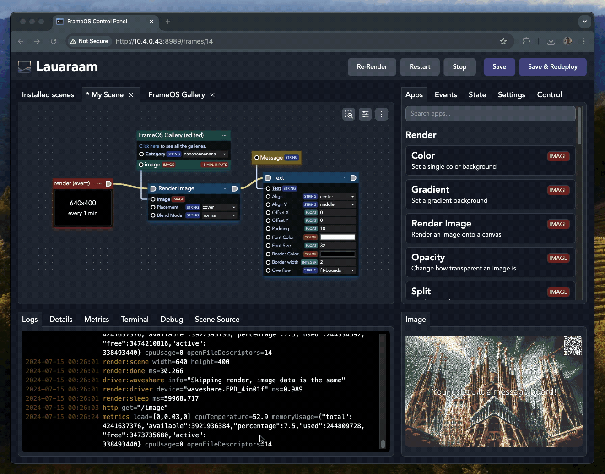
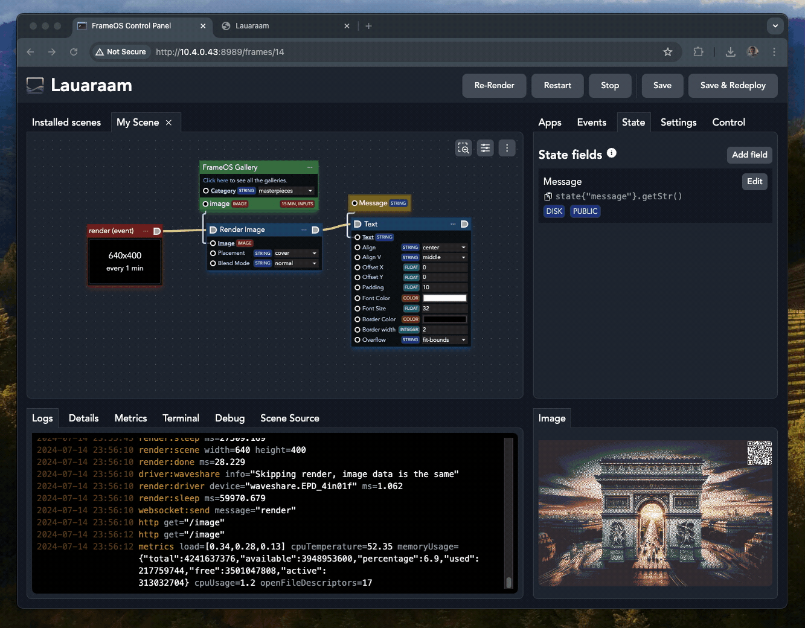
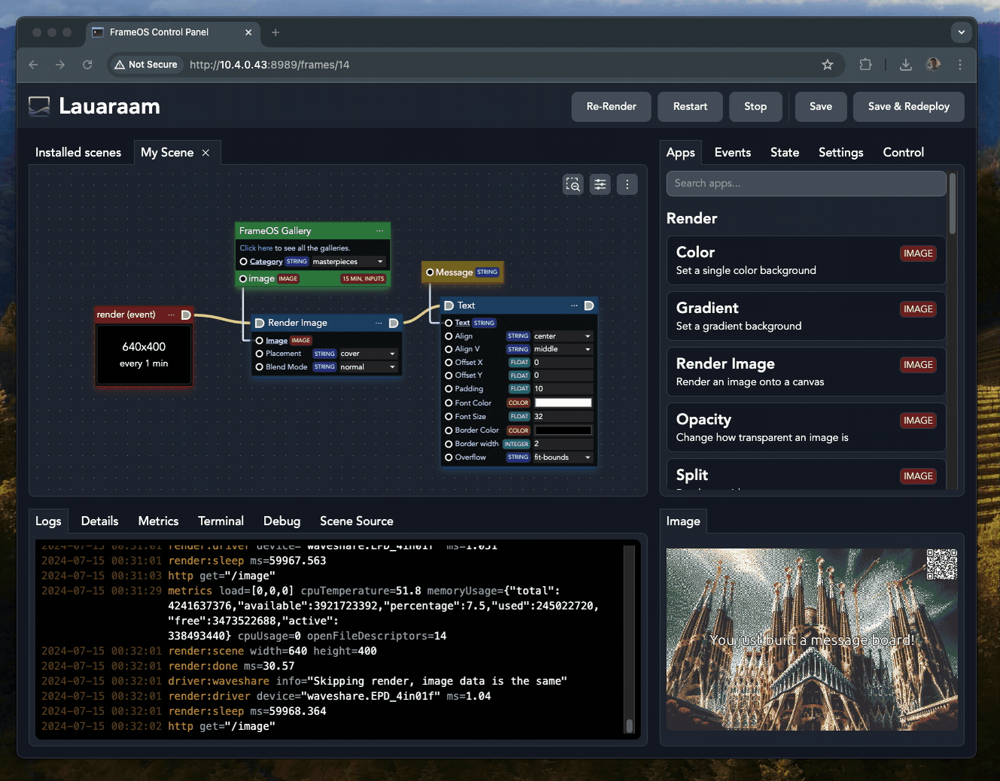

# Editing scenes

### New scene

Let's create a brand new scene. Click "+ Add new scene", fill in a random name and click "Add scene".

### Colorful nodes

There are four types of nodes: red, blue, green and yellow. 

The red nodes are event nodes. The most important event is the "render" event, which is triggered at a set interval, such as every 60 seconds.

Drag from the top-right corner to add the (blue) "render image" app.

This app will now get executed on every render. 

But what image should we render? Drag the "image" field up and choose whichever (green) data app makes sense. Use "FrameOS Gallery" if you're unsure. Then press deploy.

### Caching

Note that while the scene is set to re-render every minute, the FrameOS Gallery app is set to cache for 15 minutes.

All data apps have cache controls. These let you specify how frequently you want to update a resource.

If the frame re-renders and the resulting image is the same, there physical display itself will not re-render.

### Adding state fields

Moving on, let's add a (yellow) state field to hold the message we'll show on the image. For that you need to use the "State" tab, and drag the relevant node on the editor.

Deploy the frame and you should be able to edit the message live:

### Code nodes

There's one last node type we didn't cover: "code nodes" aka inline data apps. They're also green when not selected. Use them to quickly combine bits of data together or augment state nodes. You can write any Nim code, as long as it's in one line.

### How to learn

FrameOS comes with a lot of sample scenes. Until we release better tutorials and introduction videos, the best way to learn is to study the samples and just play around.

