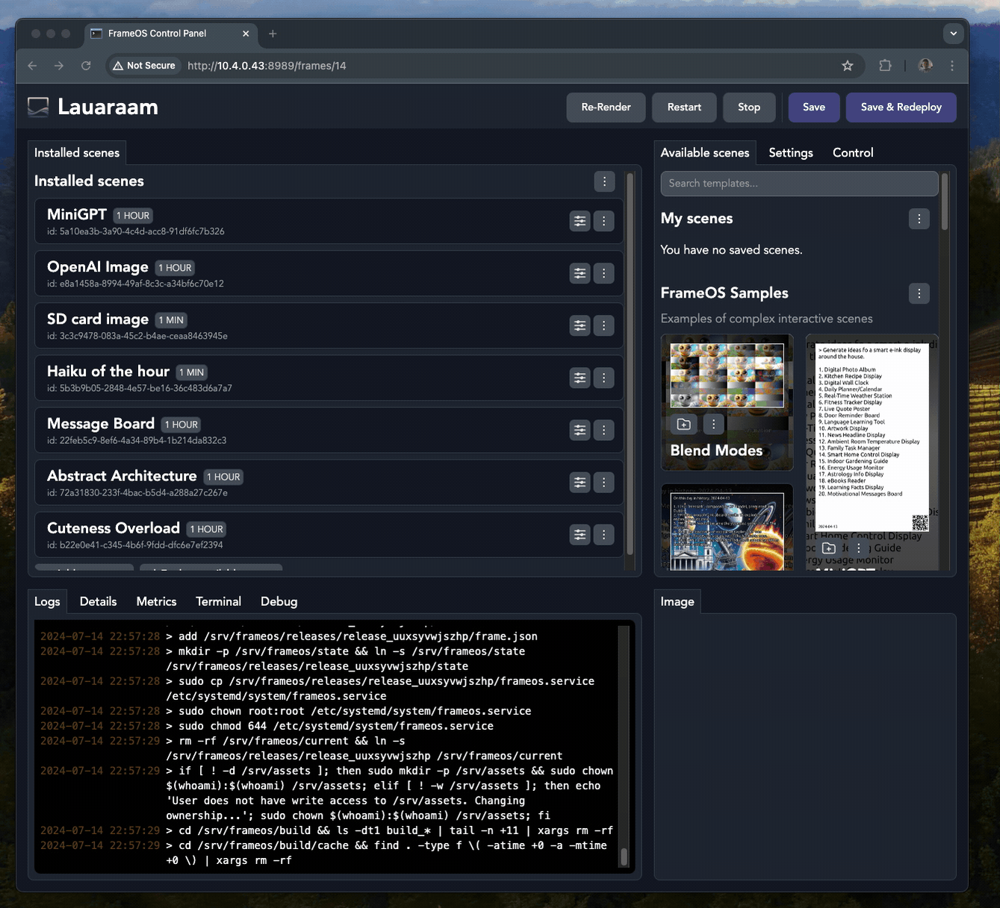
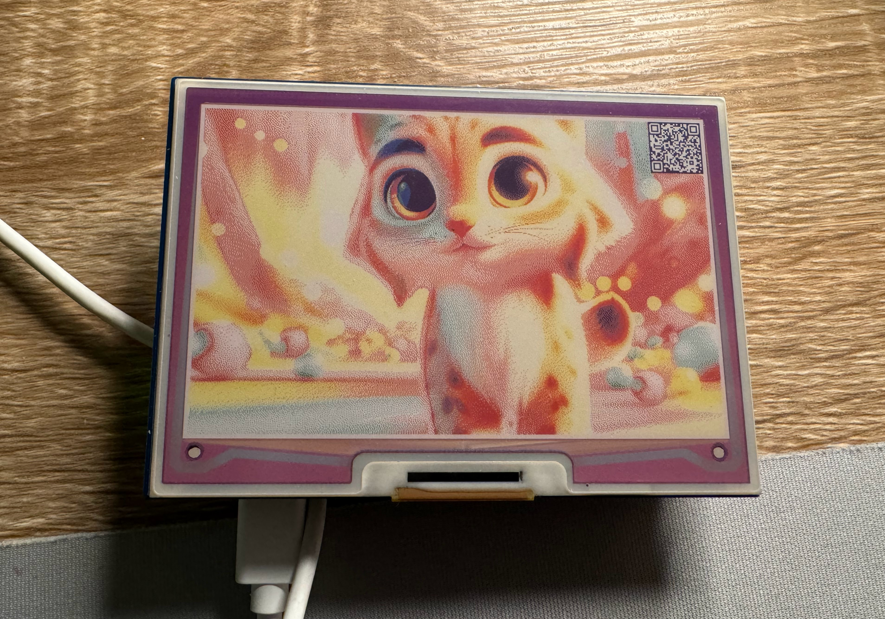
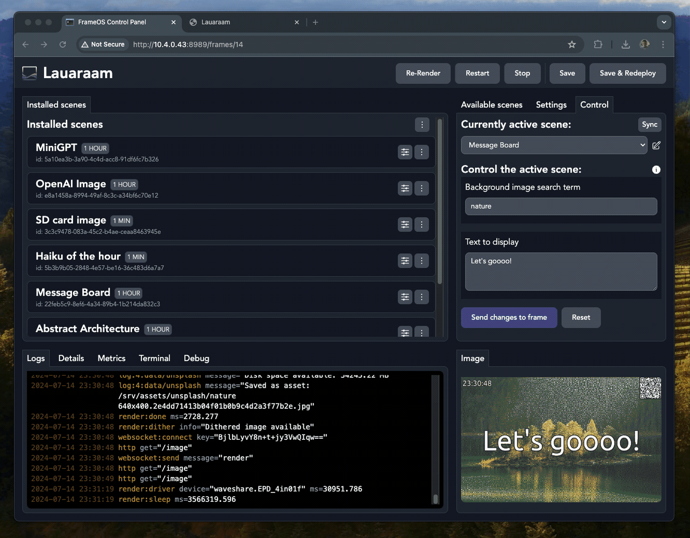

# First deploy

:::info
If you don't have the [FrameOS backend running](/guide/backend) or can't connect to your [raspberry over SSH](/guide/raspberry), read those chapters first.
:::

### Add the frame

Start by adding your frame's name and IP address into the "Add a new smart frame" dialog. Select the right driver for your display.

### Add the first scenes

Next, install some scenes from the list of available scenes, and press "Save & Redeploy".

Please note that some scenes require API keys, which can be added under the global "Settings" page.

### Deploy finishes

Once the deploy finishes, a preview image should appear, followed by the same image on the frame itself.

### Control the frame

You can control a scene with the "Control" tab. Different scenes expose different options:

You can also use the "Control URL", found under the "Details" tab, or by scanning the QR code on the frame itself.

