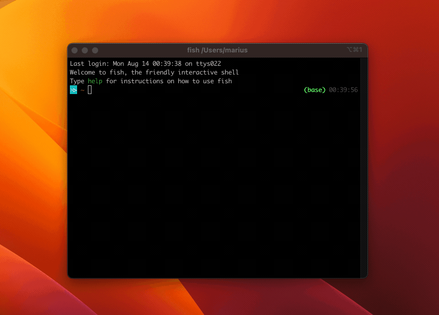

# The Raspberry

:::info
Be sure to look at the [device-specific instructions](/devices) for any changes to these steps. 
::: 

## What to choose?

Typically, you'll want to buy a **Raspberry Pi Zero 2 W**. It offers the best compromise in terms of performance, power draw, and size. It can usually be had for around 20 units of currency. Check [rpilocator](https://rpilocator.com/?cat=PIZERO2). 

The first **Pi Zero W** works as well, but takes forever to deploy. It's cheaper, and draws a tiny bit less power. However instead of four 64-bit cores, it has just one 32-bit core.

The **Raspberry Pi 5** is the fastest of them all. Use it if size isn't an issue.

## Installation

Download the [Raspberry Pi Imager](https://www.raspberrypi.com/software/) and install the **Lite version** of the latest Raspberry Pi OS, called **"Bookworm"**.

If you have a Raspberry Pi 1, 2, or Zero W, select "Raspberry PI OS Lite (32-bit)". If you have any newer model (e.g. 3, 4, Zero 2 W, 5, etc), select **"Raspberry Pi OS Lite (64-bit)"**.


Choose your SD card and write. 

When prompted, edit your settings and make sure you have set the correct hostname and WiFi credentials. 

Either set it to use user/pass authentication, or (better) generate a new keypar under settings and copy the public key here.


It'll take a while. 

Place the card into the raspberry, connect the raspberry and the frame, and power it up.

Wait until it shows up with `ping` and `ssh`. Use the provided hostname or check your router's connected clients list for the IP.



Once connected, run the following to make sure your OS is up to date:

```sh
sudo apt update -y && sudo apt upgrade -y
```

### Next steps

That's all you need. Given a SSH connection, the FrameOS [backend](/guide/backend) will do the rest.

Read next: [First deploy](/guide/first-deploy)