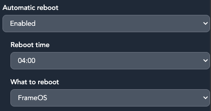

# Useful settings

Here are some useful things you can configure under the frame's "Settings" tab.

### Frame access

Each frame runs a HTTP server on port 8787 where you can view and control its contents. Frames have three access modes:

- **Private (default):** You need a key to both view and control the frame.
- **Protected:** Everyone can view the frame's image, but you need the access key to update content.
- **Public:** Everyone can view or control the frame without a key. This makes for the smallest QR codes.

Note that when access is restricted, you're still communicating over an unsecured HTTP connection. If someone captures your local network traffic, they'll have the key. Use [Tailscale](https://tailscale.com/) in a production installation to secure things.

### QR control code

By default we show the frame's Control URL as a QR code on the frame itself. This can be configured:

### Assets

By default we save downloaded images from providers like OpenAI and Unsplash onto `/srv/assets` on the frame's SD card (but only if over 100MB of space is available). This avoids wasting money for both you and the providers.

You can later view stored assets with the "Local image" app.

### Nightly reboots

The frame is configured to reboot every night to make sure nothing leaks memory and crashes the frame over an extended time. It'll look like a regular re-render for anyone watching. You can of course disable this.

### Debug logging

When you enable debug logging, you'll get more details in the logs about each app's performance.

