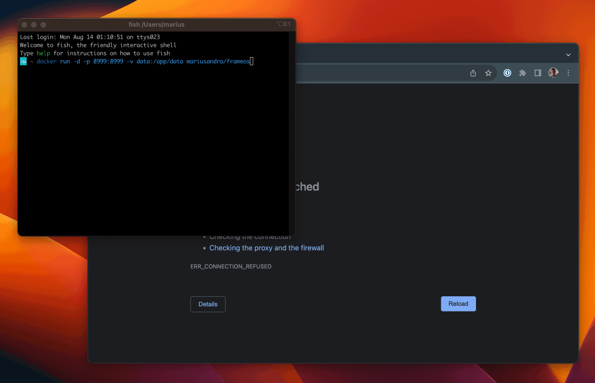
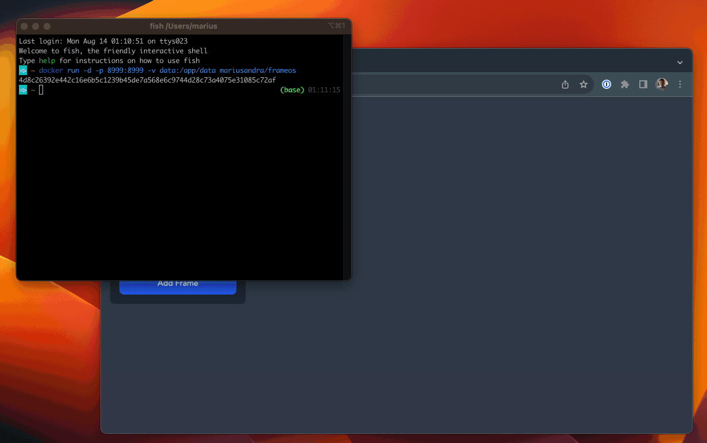
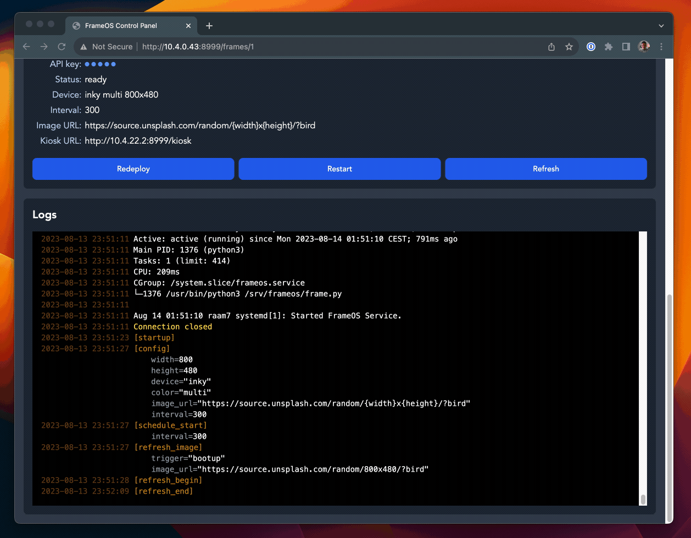
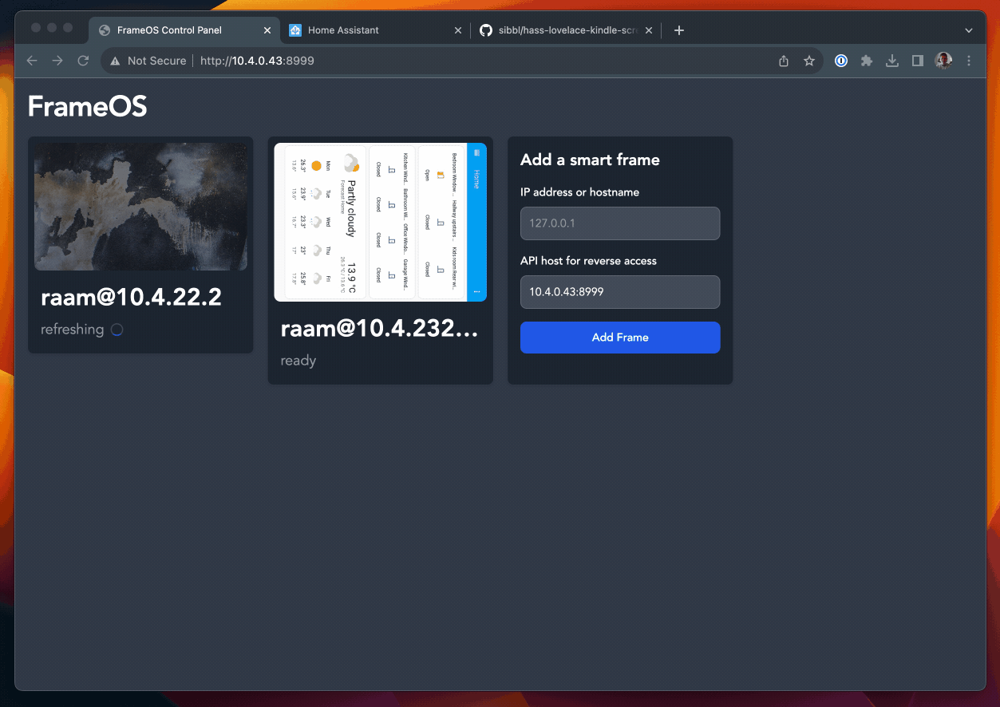

# Controller Setup

## FrameOS controller

The FrameOS controller is where you set up your frames. You can run it continuously on a server, or locally on your computer when needed. You'll miss out on log aggregation if the FrameOS server is not always on. The frames however will keep on running and updating independently.


## Running via docker

Running FrameOS via Docker is the easiest. Alternatively deploy it you'd deploy any Python + React app.

```bash
# running the latest release
docker run -d -p 8999:8999 -v data:/app/data mariusandra/frameos

# build your own from this repository
docker build . -t frameos
docker run -d -p 8999:8999 -v data:/app/data frameos
```

Then load http://0.0.0.0:8999 - ideally using a local IP that your frames can connect to.



## Install the frame

Finally, add the frame to FrameOS. Make sure both can ping each other with the IPs given.



If everything well and you have a good deploy



... you should see something like this:


Repeat the process to add more frames



