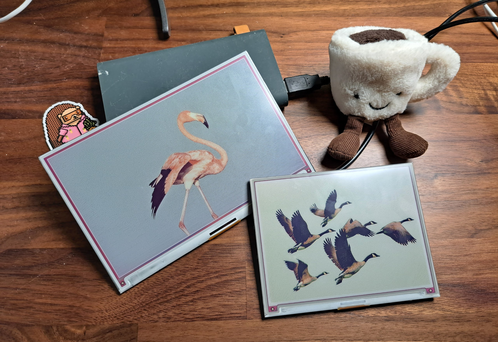

# Frame Setup

## Required hardware 

The bare minimum for web kiosk mode: 

- Any random Linux box you have SSH access to.

The recommended / supported / tested combinations:

- [Inky Impression 5.7"](https://shop.pimoroni.com/products/inky-impression-5-7?variant=32298701324371) e-ink display + [Raspberry Pi Zero W](https://amzn.to/3suqQHD) 
- [Inky Impression 7.3"](https://shop.pimoroni.com/products/inky-impression-7-3?variant=40512683376723) e-ink display + [Raspberry Pi Zero W](https://amzn.to/3suqQHD) 
- More coming soon

Attach them to a Raspberry Pi Zero W or W2, and control the render loop via FrameOS.

## Raspberry Pi setup (individual frames)

Download the [Raspberry Pi Imager](https://www.raspberrypi.com/software/) and select [Raspberry Pi OS Lite](https://www.raspberrypi.org/downloads/raspberry-pi-os/) debian `bullseye`. Select 32-bit if you have the zero w v1, otherwise select 64 bit.

Click the "Gear" icon and make sure you have set the correct hostname, ssh user/password, and WiFi credentials. Set a strong password and save it in your password manager.

Choose your SD card and write

It'll take a while

When done, place the card into the raspberry.

Place the raspberry on the artboard, and plug it in

And wait until it shows up with `ping` and `ssh`.

If you're already here, and plan on using Inky Impresson frames, run `sudo raspi-config` and

1. enable SPI
2. enable I2C

Sadly these aren't automated yet.

Now get your [controller](./controller) set up.