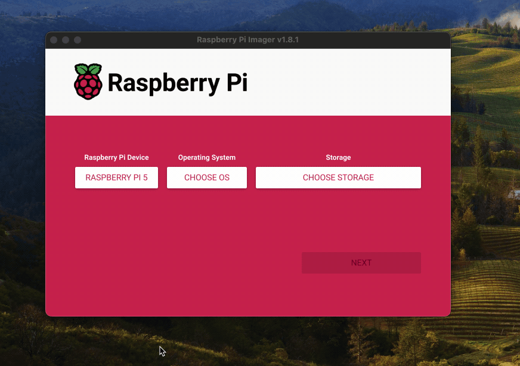
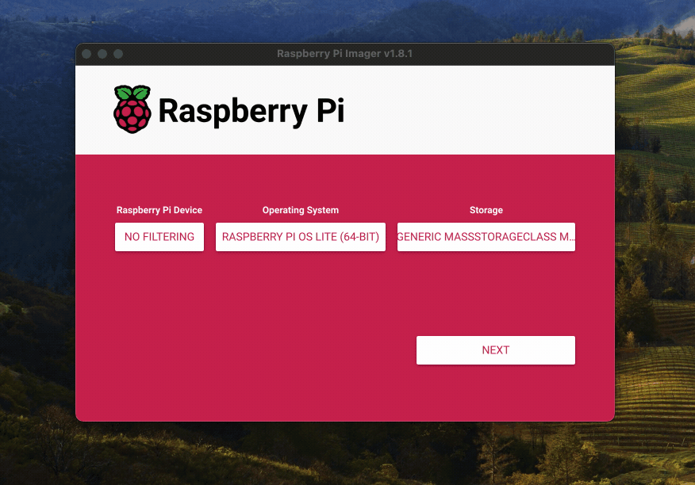
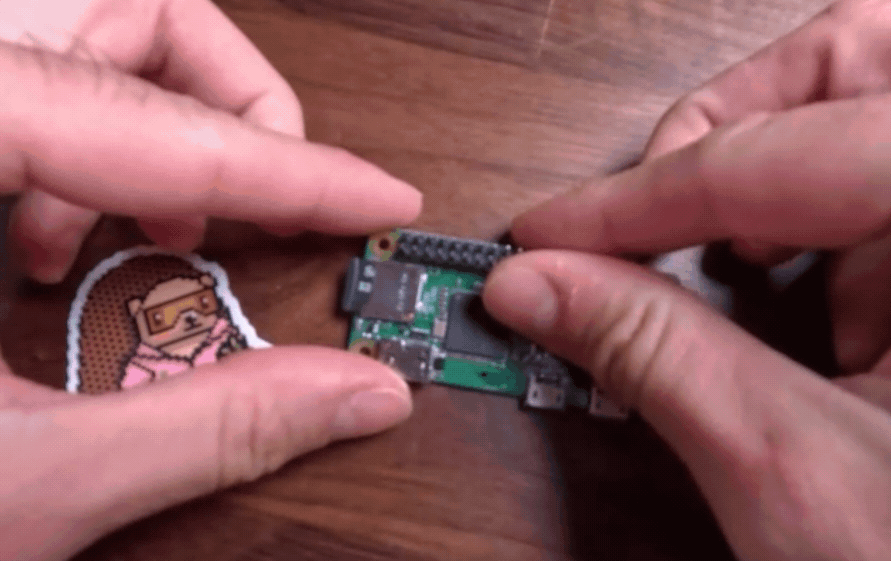
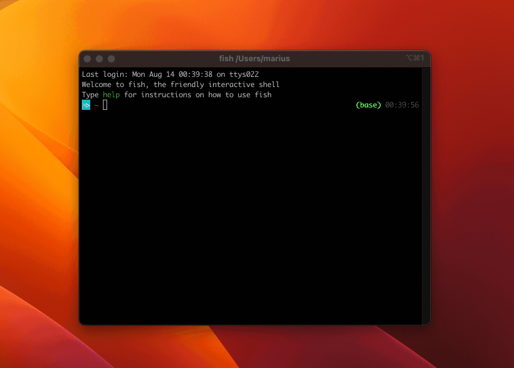

# Raspberry Setup

:::info
Be sure to look at the [device-specific instructions](/devices) for any changes to these steps. 
::: 

## What to choose?

Typically, you'll want to buy a **Raspberry Pi Zero 2 W**. It offers the best compromise in terms of performance, power draw, and size. It can usually be had for around 20 units of currency. Check [rpilocator](https://rpilocator.com/?cat=PIZERO2). 

The first **Pi Zero W** works as well. It's cheaper, and draws a tiny bit less power. However instead of four 64-bit cores, it has just one  32-bit core. This makes it a lot slower, and **unable to run a browser on device** for taking screenshots, if you're into that.  

## Installation

Download the [Raspberry Pi Imager](https://www.raspberrypi.com/software/) and install the Lite version of the latest Raspberry Pi OS, called "Bookworm".

If you have a Raspberry Pi 1, 2, or Zero W, select "Raspberry OS Lite (32-bit)". If you have any newer model (e.g. 3, 4, Zero 2 W), select "Raspberry OS Lite (64-bit)".

When prompted, edit your settings and make sure you have set the correct hostname and WiFi credentials. Copy the SSH key from the FrameOS controller's settings page as the authorized key.

Choose your SD card and write. It'll take a while. 

When done, place the card into the raspberry.

Connect the raspberry and the frame.

And wait until it shows up with `ping` and `ssh`. Use the provided hostname or check your router's connected clients for the IP.

Now get your [controller](./controller) set up if you haven't already.