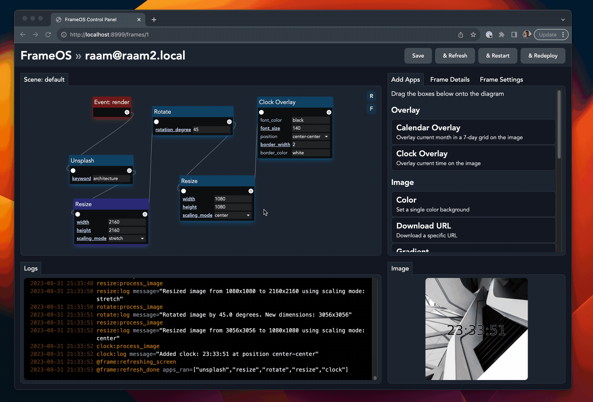

# FrameOS 

FrameOS is software purpose built for controlling Raspberry Pi-powered e-paper and LCD displays, along with links to printable cases for all supported frames. 

It consists of ~~two~~ three parts:
- **FrameOS guides** - getting started guides, links to 3d-printable models and other resources for each supported frame 
- **FrameOS device software**, deployed onto a Raspberry Pi with a screen attached to it. Written in python.
- **FrameOS controller** - the management software used to deploy changes to frames, write custom frame-apps, and aggregate logs. It's a self-hosted python webapp.

Once the device software has been deployed onto a frame, it can operate without the controller present.

## Supported platforms

See the full list here!

- Pimoroni e-ink frames
- Waveshare e-ink
- HDMI output
- Web server kiosk mode

## Status

FrameOS is currently in beta. Things are broken, and breaking changes happen all the time. It is not yet ready for production use.

If you're the adventurous type, please do try it out, and help out. We're missing all sorts of apps and overlays for example.

## Why?

Read the blog post: [Why FrameOS?](/blog/why-frameos)