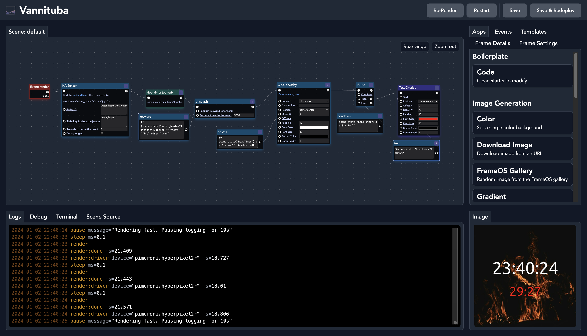

# FrameOS 

FrameOS is an **operating system for single function smart frames**. 

It's meant to be deployed on a Raspberry Pi, and can be used with a variety of e-ink and traditional displays. It's designed for both screens that update **60 seconds per frame**, and for screens that update **60 frames per second**.

Think smart home calendars, meeting room displays, thermostats, industrial dashboards, public advertisement screens, and more. 

Features:

1. **Centralized Deployment:** The FrameOS Controller connects to Raspberry Pis via SSH for direct software installation.

2. **Compiled & Efficient**: FrameOS is written [in Nim](https://nim-lang.org/), a compiled language. Your final configuration gets compiled down into a single efficient binary that contains all apps and assets.

2. **Diagram Editor**: A drag-and-drop interface to combine Nim apps into scenes. Fork and edit existing apps like "OpenAI image", and "Text overlay" to suit your needs. Overwrite all fields with inline code snippets.

4. **GPT4 Support**: Ask your favourite LLM to write and debug FrameOS apps for you.

5. **Hardware Guides**: For tested displays, we provide hardware guides, installation instructions, and 3D printable cases.

## Getting started

1. Start by installing the [FrameOS controller](/installation/controller).
2. Then set up [the raspberry](/installation/raspberry), while following the [device guide](/devices) for your specific screen.

## Supported platforms

We support all the most common e-ink displays out there.

- Pimoroni e-ink frames
- Waveshare e-ink
- Framebuffer HDMI output
- Web server kiosk mode

[See the full list here!](/devices)

## Status

FrameOS is **good enough for home and hobbyist usage**.

This software is still in early development, and does not have a stable release. A docker image is generated for every push to `main`. There are no guarantees things won't suddenly break between releases, despite our best efforts.

If you're the adventurous type, please try it out, and help out. Look at [the tasklist](https://github.com/FrameOS/frameos/issues/1) for ideas. Don't ask for permission, just submit a PR. If you're not sure, open an issue and we'll discuss it.

## Why?

- Read the blog post: [Why FrameOS?](/blog/why-frameos)

- Read more about the [Nim rewrite](/blog/nim-rewrite).
