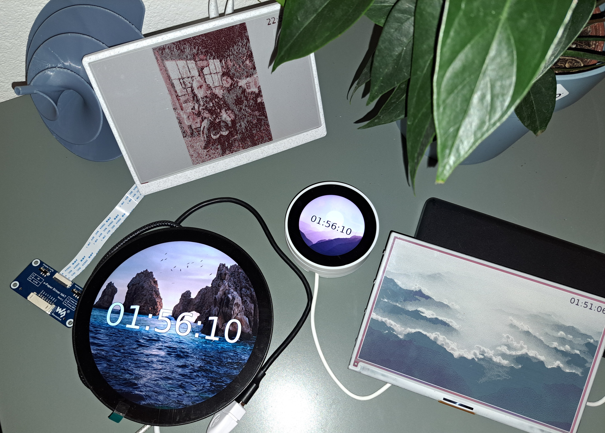

# FrameOS 

FrameOS is a software system for Raspberry Pi-powered e-ink and LCD screens.

Features:

1. **Centralized Deployment:** The FrameOS Controller connects to Raspberry Pis via SSH for direct software installation.

2. **Diagram Editor**: A drag-and-drop interface to combine apps into scenes, with prebuilt apps like "Website screenshot", "OpenAI image" and "Calendar overlay".

3. **Python Apps**: Apps in FrameOS are Python-based, and can be edited in the controller. Fork existing apps, or write your own.

4. **Template Repository**: A collection of scene templates for quick deployment. Save and share your own.

5. **Hardware Guides**: For most supported displays, we provide hardware guides, installation instructions, and 3D printable cases.

## Getting started

1. Start by installing the [FrameOS controller](/installation/controller).
2. Then read the [hardware guide](/devices) for your configuration.

## Supported platforms

We support all the most common e-ink displays out there.

- Pimoroni e-ink frames
- Waveshare e-ink
- Framebuffer HDMI output
- Web server kiosk mode

[See the full list here!](/devices)

## Status

FrameOS is currently in beta. Things are broken, and breaking changes happen all the time. It is not yet ready for production use.

If you're the adventurous type, please do try it out, and help out. We're missing all sorts of apps and overlays for example.

## Why?

Read the blog post: [Why FrameOS?](/blog/why-frameos)
