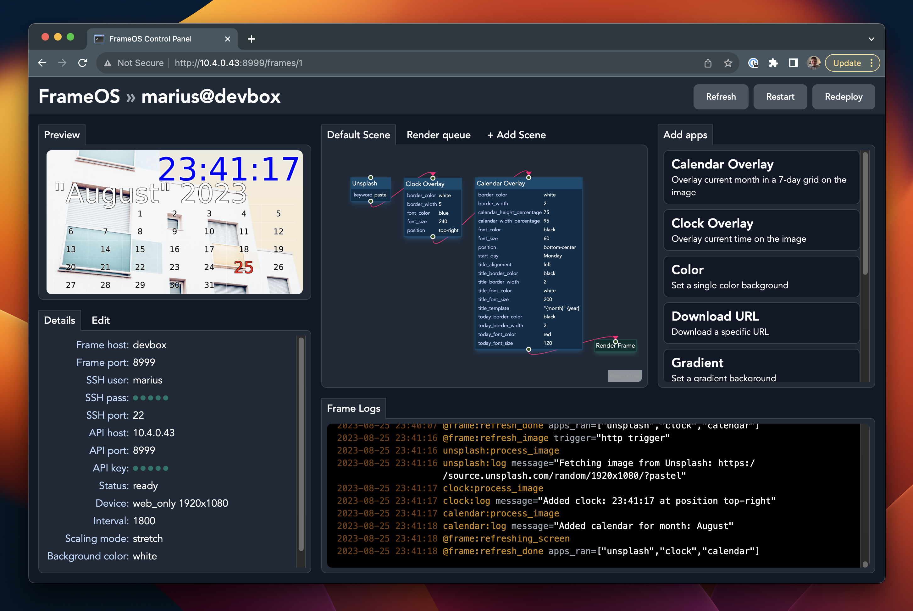

# Smart e-ink displays?

Looking to build or install some e-ink powered displays around the house? You've come to the right place. Below you'll find guides on how buying, building, and setting up your own e-ink displays. 

You'll also learn about FrameOS, the software to control them. It's still in early stages of development, but usable enough to get some random images showing. 

