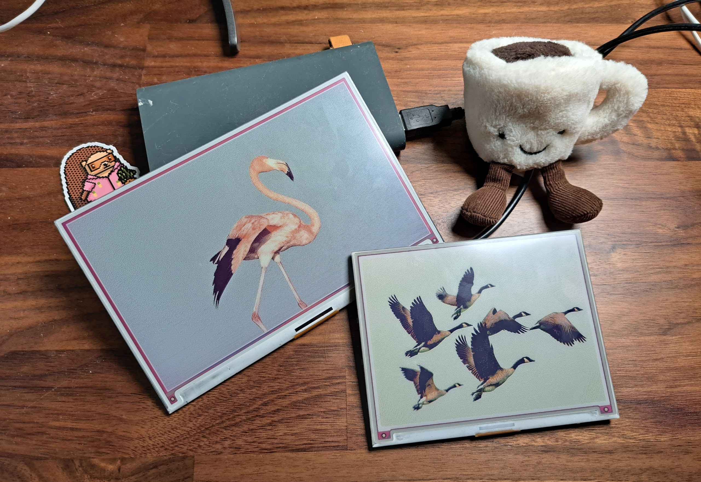

# FrameOS 

FrameOS is software purpose built for controlling Raspberry Pi-powered LCD and e-ink displays.

It consists of two parts:
- The FrameOS controller, which is a dockerized Python app running somewhere on your network, or temporarily on your laptop. You use this to deploy software onto the individual frames, and read logs.
- The FrameOS software itself, which is deployed onto a Raspberry Pi (usually Zero W or W2) that has an e-ink or LCD display attached. Once deployed, it can operate without the controller.

## Supported platforms
- Pimoroni e-ink frames
- Waveshare e-ink (soon)
- HDMI output
- Web server kiosk mode

## Status

FrameOS is currently in beta. Things are broken, and breaking changes happen all the time. It is not yet ready for production use.

Yet if you're the adventurous type, please do try it out, and contribute back. We're missing all sorts of apps and overlays for example.

## Why?

Read the blog post: [Why FrameOS?](/blog/why-frameos)