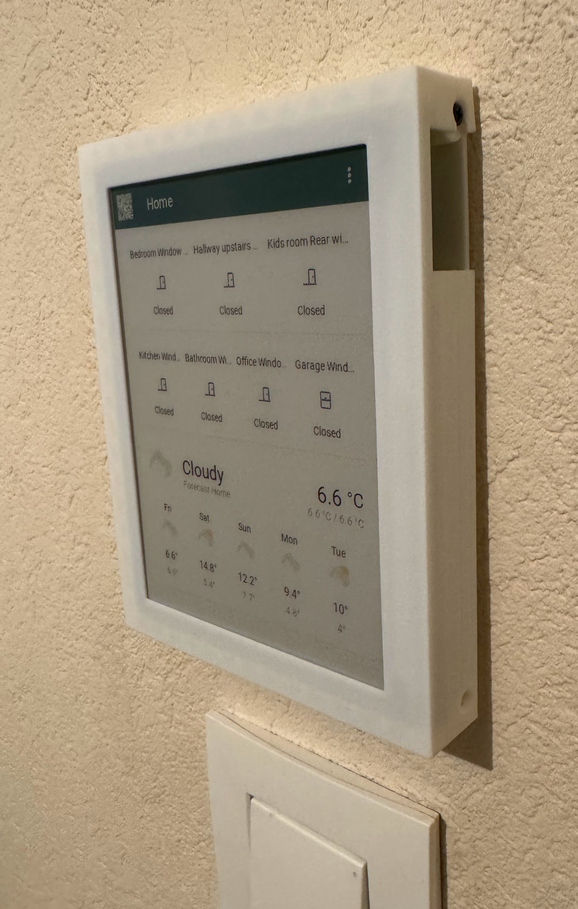
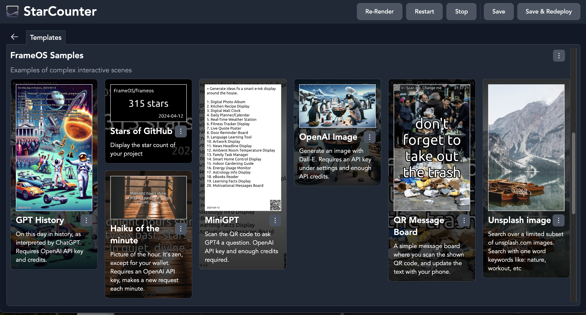
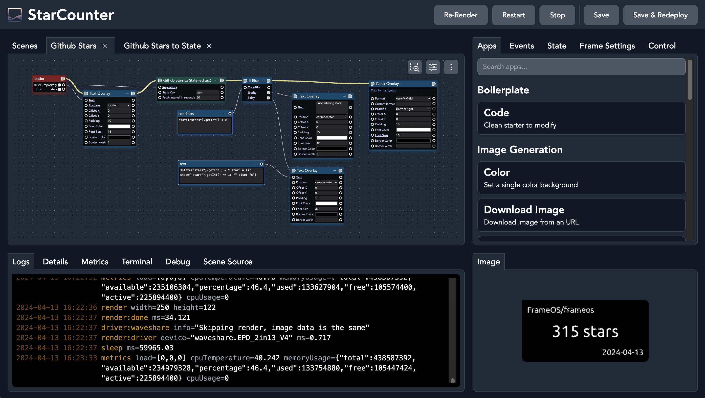
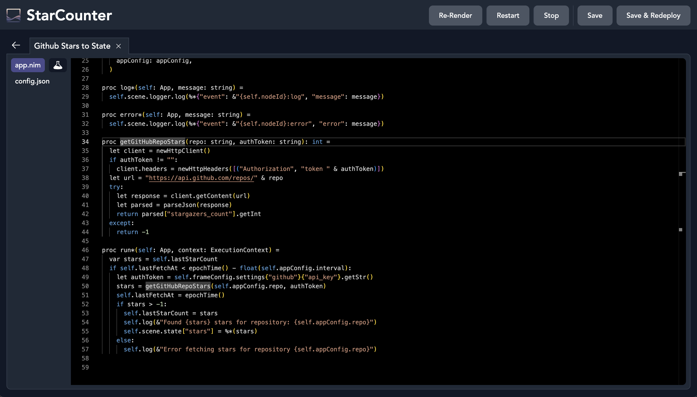

# FrameOS 

### An operating system for <u>single function smart frames</u>. 

Think smart home calendars, meeting room displays, thermostats, interactive message boards, public advertisement screens, and more. 

| Dashboard | Thermostat | Message board |
|---|---|---|
|  Tells me which windows are open before leaving the house  |   Hot water control and clock in the bathroom | QR-code controlled kitchen message board |

It's designed for both screens that update **60 frames per second**, and for screens that update **60 seconds per frame**.

### What do you need?

- A Raspberry Pi. Any will do, but the [Zero W 2](https://www.raspberrypi.com/products/raspberry-pi-zero-2-w/) hits the sweet spot for eink displays (cheap, multicore, low power), and can easily do 24 FPS on small LCDs.
- A display of some sort. E-ink or LCD. Take your pick from [Waveshare](https://www.waveshare.com/product/displays/e-paper/epaper-1.htm) or 
[Pimoroni](https://shop.pimoroni.com/collections/displays)'s e-ink HATs, or hook up a TV with an HDMI cable. To get 60FPS over HDMI you'll need a [Raspberry Pi 5](https://www.raspberrypi.com/products/raspberry-pi-5/) though.
- A server for hosting the FrameOS controller. You'll use this to setup your scenes, and deploy them onto frames via SSH. FrameOS is written in [nim](https://nim-lang.org/), and gets compiled into a single binary.

### Sample scenes

Once setup, deploy your first scene from [the scene templates repository](https://repo.frameos.net/):

The list of samples keeps growing, so check back often.

### Create your own scenes

Didn't find what you need? 
Visually connect apps like "Text Overlay" and "OpenAI Image" to build your own scenes:

Go a step deeper, fork these prebuilt apps, and/or build new ones from scratch:

## Getting started

1. Start by installing the [FrameOS controller](/installation/controller).
2. Then set up [the raspberry](/installation/raspberry), while following the [device guide](/devices) for your specific screen.

## Supported platforms

Supported are all the most common e-ink displays out there (most [Waveshare](https://www.waveshare.com/product/displays/e-paper/epaper-1.htm) and
[Pimoroni](https://shop.pimoroni.com/collections/displays) panels), and anything you can connect over HDMI. [See the full list here!](/devices)

## Status

FrameOS is good enough for small-time usage. The experience of building apps is still a bit wonky, but most of the core concepts are in place.

We haven't released a numbered version yet. A `FrameOS/frameos:latest` docker image is generated for every push to `main`. While we take great care not to break things, there are no guarantees at this point.

If you're the adventurous type, please try it out, and help out. Look at [the tasklist](https://github.com/FrameOS/frameos/issues/1) for ideas. Don't ask for permission, just submit a PR. If you're not sure, open an issue and we'll discuss it.

## Next steps:

- Start by installing the [FrameOS controller](/installation/controller).

- Read the blog post: [Why FrameOS?](/blog/why-frameos)

- Read more about the [Nim rewrite](/blog/nim-rewrite).
