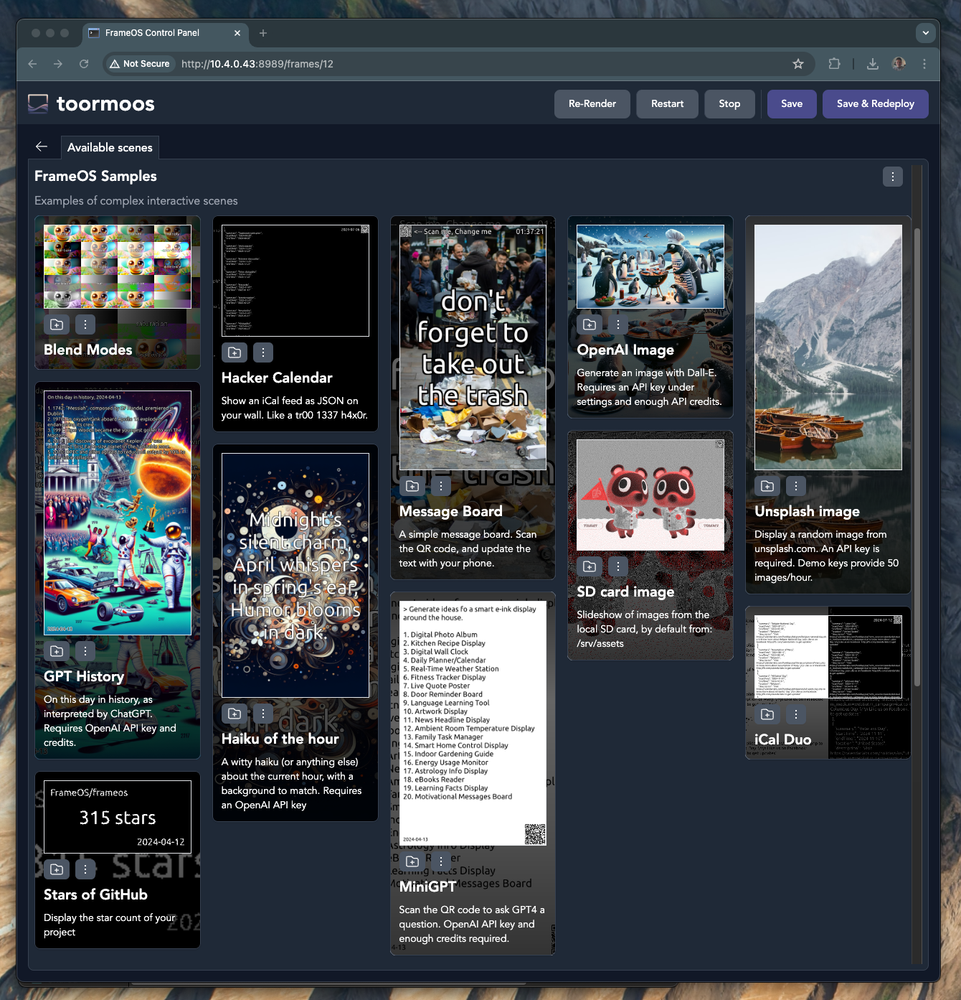

# FrameOS 

### An operating system for <u>single function smart frames</u>. 

It's designed for both screens that update **60 frames per second**, and for screens that update **60 seconds per frame**.
Think smart home calendars, meeting room displays, thermostats, interactive message boards, public advertisement screens, and more. 

FrameOS is written in [nim](https://nim-lang.org/), and gets compiled into a single binary when deployed.

### What do you need?

- A display of some sort. E-ink or LCD. Take your pick from [Waveshare](https://www.waveshare.com/product/displays/e-paper/epaper-1.htm) or 
[Pimoroni](https://shop.pimoroni.com/collections/displays)'s e-ink HATs, or hook up a TV with an HDMI cable. 
- A Raspberry Pi.
  - If size matters, use the [Zero W 2](https://www.raspberrypi.com/products/raspberry-pi-zero-2-w/). It's great for eink displays, and can even do 24 FPS on small LCDs. 
  - For maximum peformance, (e.g. 60FPS over HDMI) you'll need a [Raspberry Pi 5](https://www.raspberrypi.com/products/raspberry-pi-5/).
- A server to host the FrameOS backend. It'll need to be able to connect to the frames over SSH. Use [Tailscale](https://tailscale.com/) on all devices if they're not all in the same network.

### FrameOS backend

You use this self-hosted application to deploy scenes onto frames.
You can deploy from a growing library of prebuilt scenes, or use the visual editor to arrange the nodes that make up a scene yourself.
If that's not enough, edit the nim source directly.

### Sample frames

Here are some frames I have around the house.

|  |  |
|---|---|
|  Hallway dashboard | Kitchen calendar |
| Bathroom thermostat |  Scan the code to change the text |

### Sample scenes

Deploy your first scene from the list of prebuilt templates:

## Getting started

1. Start by installing the [FrameOS backend](/guide/backend).
2. Then set up [the raspberry](/guide/raspberry), while following the [device guide](/devices) for your specific screen.
3. Finally, read the [rest of the guide](/guide/first-deploy) to learn how to build your own scenes.

## Status

FrameOS is good enough for small-time usage. Most of the core concepts are in place.

There is no numbered release yet. A `FrameOS/frameos:latest` docker image is generated for every push to `main`. While we take great care not to break things, there are no guarantees at this point.

If you're the adventurous type, please try it out, and help out. Look at [the tasklist](https://github.com/FrameOS/frameos/issues/1) for ideas. Don't ask for permission, just submit a PR. If you're not sure, open an issue and we'll discuss it.

## Next steps

- Start by installing the [FrameOS backend](/guide/backend).

- Read the blog post: [Why FrameOS?](/blog/why-frameos)

- Read more about the [Nim rewrite](/blog/nim-rewrite).
