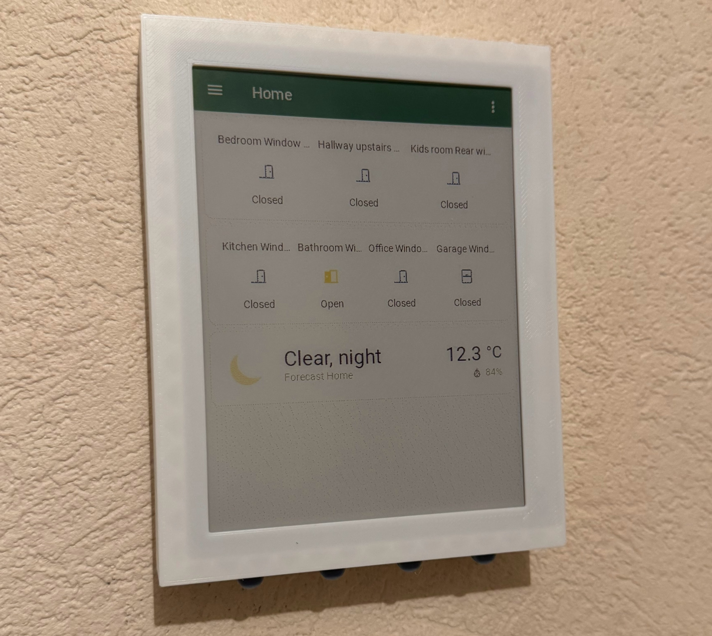
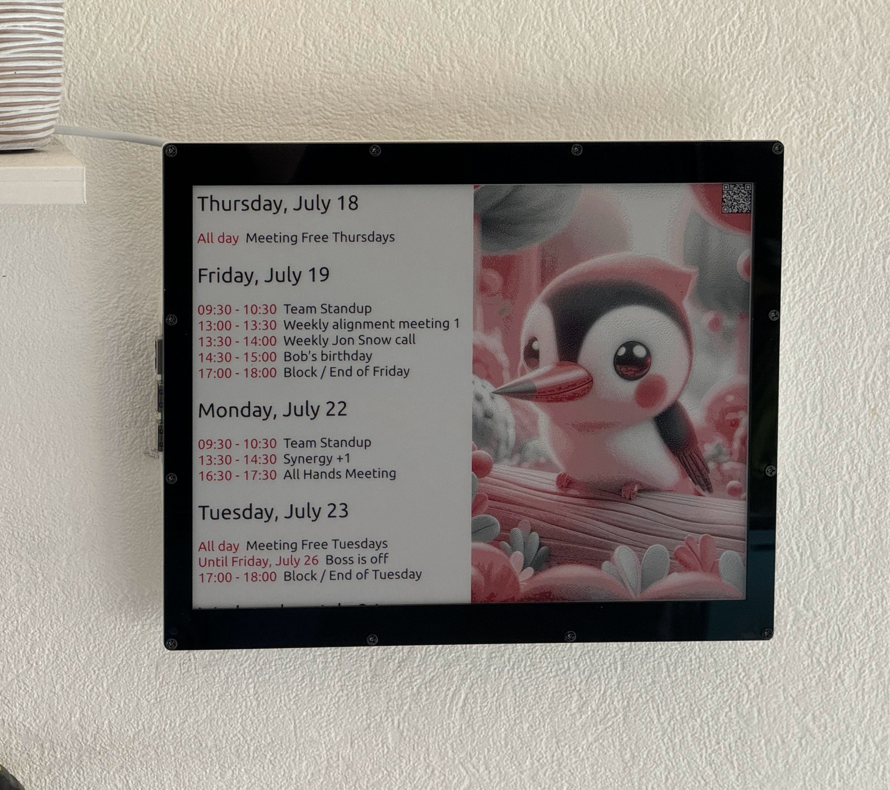
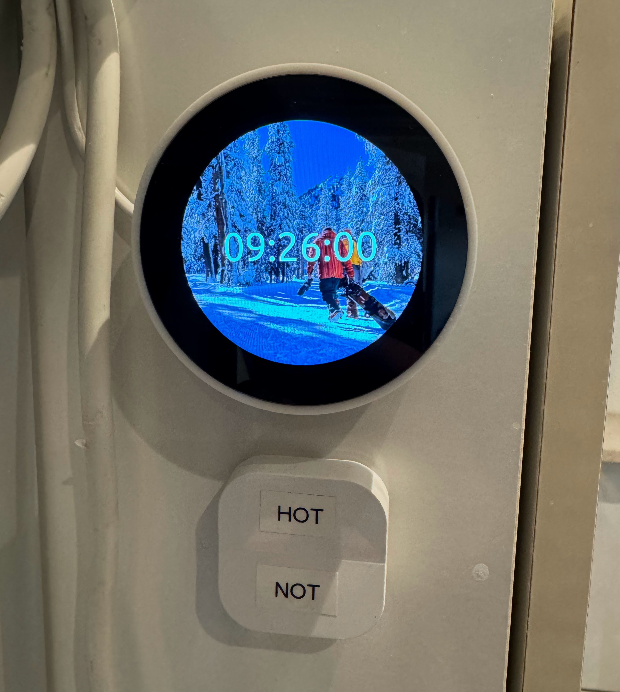
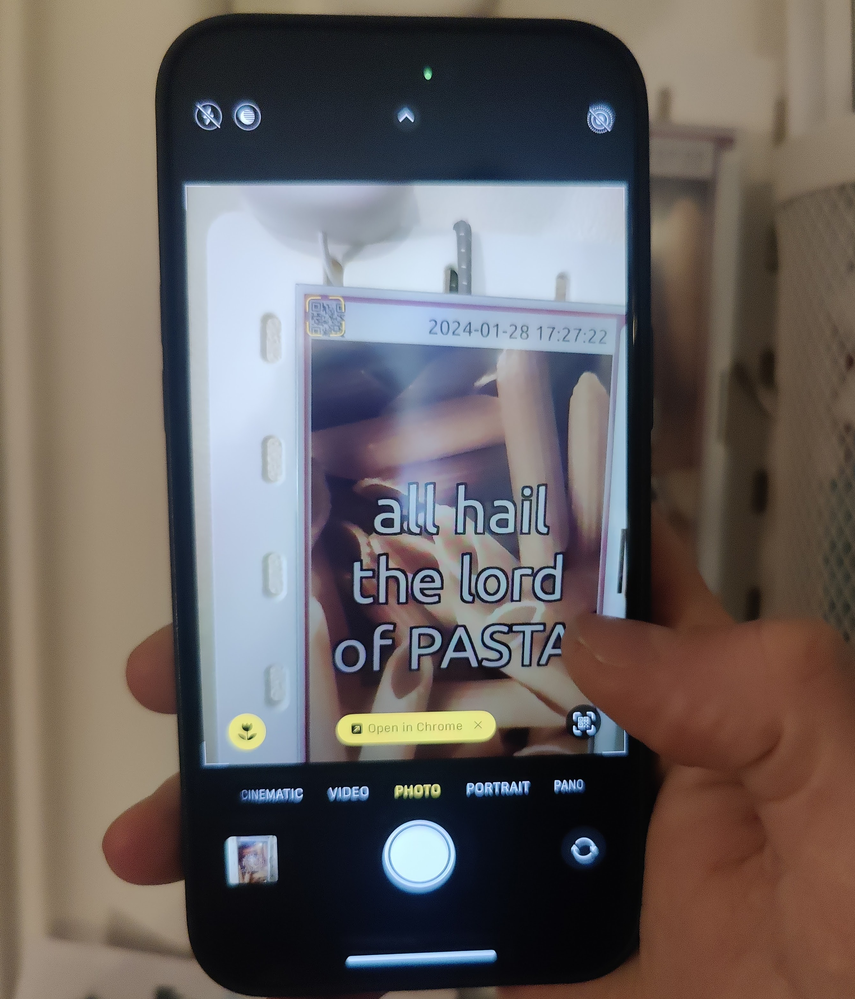
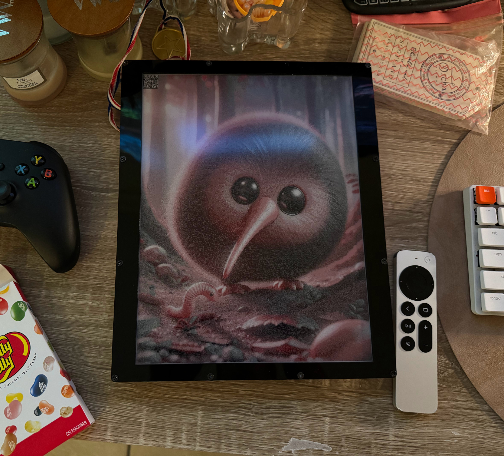
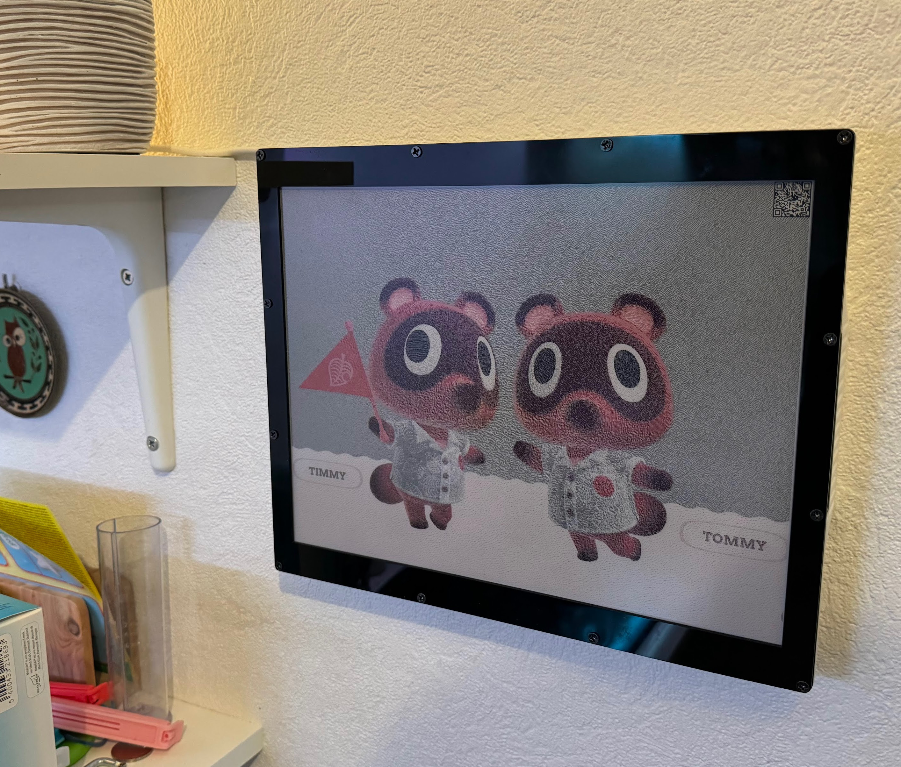
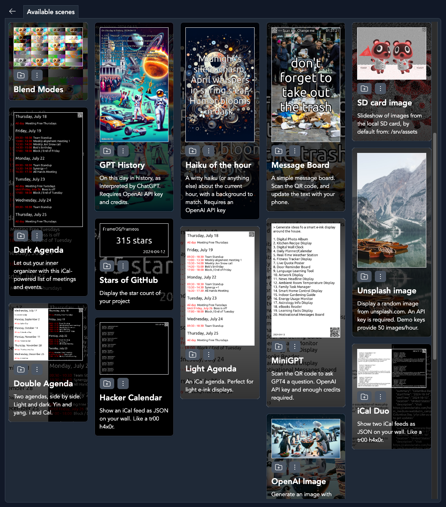
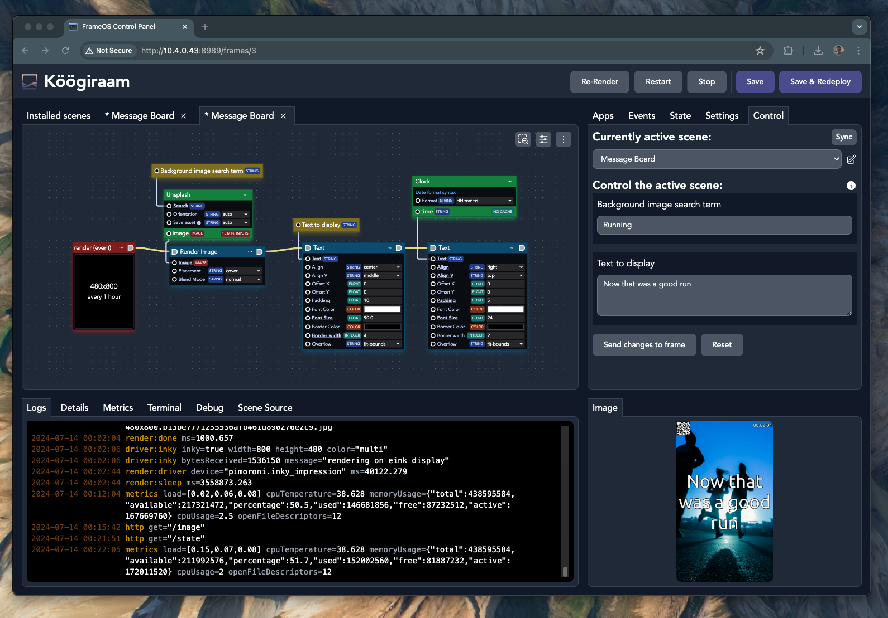
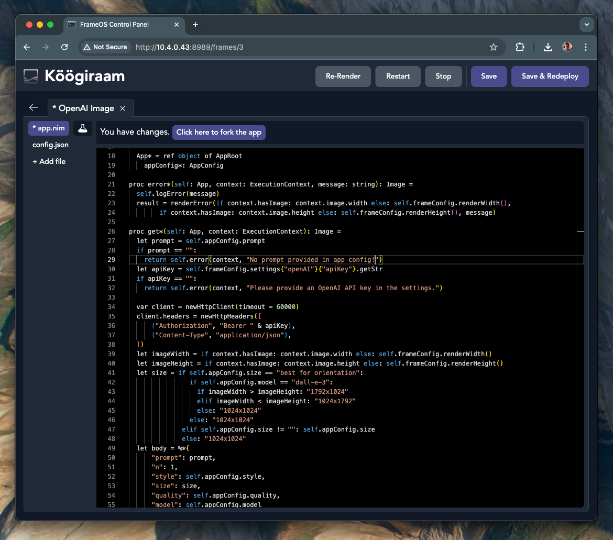

# FrameOS 

### An operating system for <u>single function smart frames</u>. 

It's designed for both screens that update **60 frames per second**, and for screens that update **60 seconds per frame**.
Think smart home calendars, meeting room displays, thermostats, interactive message boards, public advertisement screens, and more. 

FrameOS is written in [nim](https://nim-lang.org/), and gets compiled into a single binary when deployed.

### What do you need?

- A display of some sort. E-ink or LCD. Take your pick from [Waveshare](https://www.waveshare.com/product/displays/e-paper/epaper-1.htm) or 
[Pimoroni](https://shop.pimoroni.com/collections/displays)'s e-ink HATs, or hook up a TV with an HDMI cable. 
- A Raspberry Pi.
  - For maximum peformance, (e.g. 60FPS over HDMI) you'll need a [Raspberry Pi 5](https://www.raspberrypi.com/products/raspberry-pi-5/).
  - If size matters, use the [Zero W 2](https://www.raspberrypi.com/products/raspberry-pi-zero-2-w/). It's great for eink displays, and can even do 24 FPS on small LCDs.
- Someplace to run the FrameOS backend. Either run it [locally via docker](https://frameos.net/guide/backend#running-via-docker), or host it on a server. It'll connect to the frames using SSH.

### FrameOS backend

You use this self-hosted application to deploy scenes onto frames.

### Sample frames

Here are some frames I have around the house.

|  |  |
|---|---|
|  Hallway dashboard 5.7" 7-color | Kitchen calendar 12.48" 3-color |
|  Bathroom thermostat 2.1" LCD |  Scan the code to change the text |
|  12.48" 3-color dithered art |  More 12.48" 3-color wall art |

### Sample scenes

Deploy your first scene from the list of prebuilt templates.

### Scene editor

Create new scenes using the diagram editor.

### App editor

Go even deeper and edit the source behind each app on the scene

## Getting started

1. Start by installing the [FrameOS backend](/guide/backend).
2. Then set up [the raspberry](/guide/raspberry), while following the [device guide](/devices) for your specific screen.
3. Finally, read the [rest of the guide](/guide/first-deploy) to learn how to build your own scenes.

## Status

FrameOS is good enough for small-time usage. Most of the core concepts are in place.

There is no numbered release yet. A `FrameOS/frameos:latest` docker image is generated for every push to `main`. While we take great care not to break things, there are no guarantees at this point.

If you're the adventurous type, please try it out, and help out. Look at [the tasklist](https://github.com/FrameOS/frameos/issues/1) for ideas. Don't ask for permission, just submit a PR. If you're not sure, open an issue and we'll discuss it.

## Next steps

- Start by installing the [FrameOS backend](/guide/backend).

- Read the blog post: [Why FrameOS?](/blog/why-frameos)

- Read more about the [Nim rewrite](/blog/nim-rewrite).

<form
  action="https://buttondown.email/api/emails/embed-subscribe/frameos"
  method="post"
  target="popupwindow"
  onsubmit="window.open('https://buttondown.email/frameos', 'popupwindow')"
  class="embeddable-buttondown-form"
>
  <ul><li><label for="bd-email">Subscribe to the newsletter: </label>
  <input type="email" name="email" id="bd-email" placeholder="you@email.com" />
  <input type="submit" value="Subscribe" /></li></ul>
</form>
