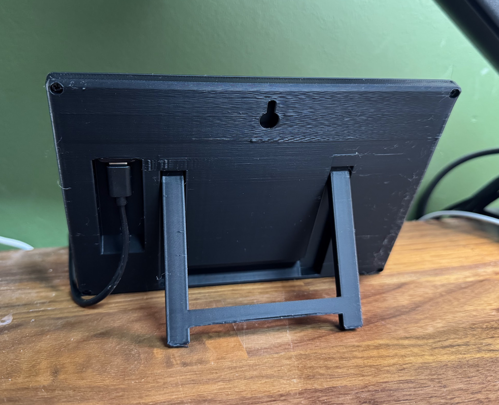

# FrameOS


### An operating system for <u>single function smart frames</u>. 

It's designed for both screens that update **60 frames per second**, and for screens that update **60 seconds per frame**.
Think smart home calendars, meeting room displays, thermostats, interactive message boards, public advertisement screens, and more. 

FrameOS is written in [nim](https://nim-lang.org/), and gets compiled into a single binary when deployed. Everything runs locally on device, 
there is no cloud to subscribe to.

<iframe width="100%" style={{"aspect-ratio": "16 / 9"}} src="https://www.youtube.com/embed/hpfgWoF0-38" title="FrameOS NimConf 2024" frameborder="0" allow="accelerometer; autoplay; clipboard-write; encrypted-media; gyroscope; picture-in-picture; web-share" referrerpolicy="strict-origin-when-cross-origin" allowfullscreen></iframe>

### FrameOS backend

You use the backend to deploy _FrameOS_ onto _frames_.

It can be installed as a **[Home Assistant Addon](https://github.com/FrameOS/frameos-home-assistant-addon)** 
or as a standalone docker app with a single command:

```bash
curl -fsSL https://frameos.net/install.sh | bash
```

Here's what it looks like:

[](./guide/_img2/frameos-backend.gif)

### What do you need to get started?

- Someplace to run the FrameOS backend. Run it locally or on a server. It'll connect to the frames with SSH.
- A display of some sort. E-ink or LCD. Take your pick from [Waveshare](https://www.waveshare.com/product/displays/e-paper/epaper-1.htm) or
[Pimoroni](https://shop.pimoroni.com/collections/displays)'s e-ink HATs, or hook up a TV with an HDMI cable.
- A Raspberry Pi with a stock Raspberry Pi OS Lite installed.
  - For maximum peformance, (e.g. 60FPS over HDMI) you'll need a [Raspberry Pi 5](https://www.raspberrypi.com/products/raspberry-pi-5/).
  - If size matters, use the [Zero W 2](https://www.raspberrypi.com/products/raspberry-pi-zero-2-w/). It's great for eink displays, and can even do 24 FPS on small LCDs.


### Sample frames

Here are some frames I have around the house.

|  |  |
|---|---|
| [](./_img/IMG_5975.jpg) [3D printed cases](https://cases.frameos.net) with kickstands for 7.3" and 13.3" panels|[](./_img/IMG_6030.jpg) Same 13.3" full color e-ink display on the wall |
| [](./_img/slop.jpg) As much AI slop as you can handle |[](./_img/IMG_6022.jpg) The included kickstand |
| [](./_img/frame-bathroom.jpg) Also works with real time LCDs | [](./_img/phone-pasta-2.jpg) Scan the code to change the text |
| [](./_img/ukseraam.jpg) Hallway dashboard 5.7" 7-color |[](./_img/kitchen-calendar2.jpg) Kitchen calendar 12.48" 3-color |

### Sample scenes

Deploy your first scene from [the repository](https://repo.frameos.net/).

[](./_img/sample-scenes2.png)

### Scene editor

Create new scenes using the diagram editor.

[](./_img/good-run.png)

### App editor

Go even deeper and edit the source behind each app on the scene

[](./_img/fork-openai.png)

## Getting started

1. Start by installing the [FrameOS backend](/guide/backend). `curl -fsSL https://frameos.net/install.sh | bash`
2. Then set up [the raspberry](/guide/raspberry), while following the [device guide](/devices) for your specific screen.
3. Finally, read the [rest of the guide](/guide/first-deploy) to learn how to build your own scenes.

## Status

FrameOS is good enough for small-time usage. Most of the core concepts are in place.

There is no numbered release yet. A `FrameOS/frameos:latest` docker image is generated for every push to `main`. While we take great care not to break things, there are no guarantees at this point.

If you're the adventurous type, please try it out, and help out. Look at [the tasklist](https://github.com/FrameOS/frameos/issues/1) for ideas. Don't ask for permission, just submit a PR. If you're not sure, open an issue and we'll discuss it.

Finally, [subscribe to the (yet unpublished) newsletter](https://buttondown.com/frameos?tag=sandwich) to be the first to hear of news and updates.

[//]: # (<form)
[//]: # (  action="https://buttondown.email/api/emails/embed-subscribe/frameos")
[//]: # (  method="post")
[//]: # (  target="popupwindow")
[//]: # (  onsubmit="window.open&#40;'https://buttondown.email/frameos', 'popupwindow'&#41;")
[//]: # (  class="embeddable-buttondown-form")
[//]: # (>)
[//]: # (  <div><label for="bd-email">Finally, subscribe to the newsletter to be the first to hear of news and updates: </label>)
[//]: # (  <input type="email" name="email" id="bd-email" placeholder="you@email.com" />)
[//]: # (  <input type="submit" value="Subscribe" /></div>)
[//]: # (</form>)

## Next steps

- Join the [FrameOS discord](https://discord.gg/9dT9y7EzUw)

- Install the [FrameOS backend](/guide/backend).

- Read the blog post: [Why FrameOS?](/blog/why-frameos)

- Read more about the [Nim rewrite](/blog/nim-rewrite).
